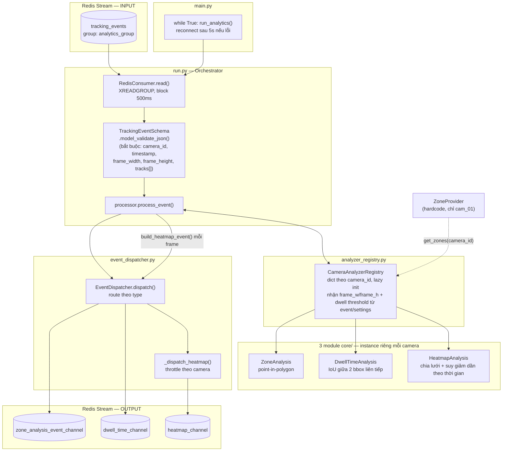
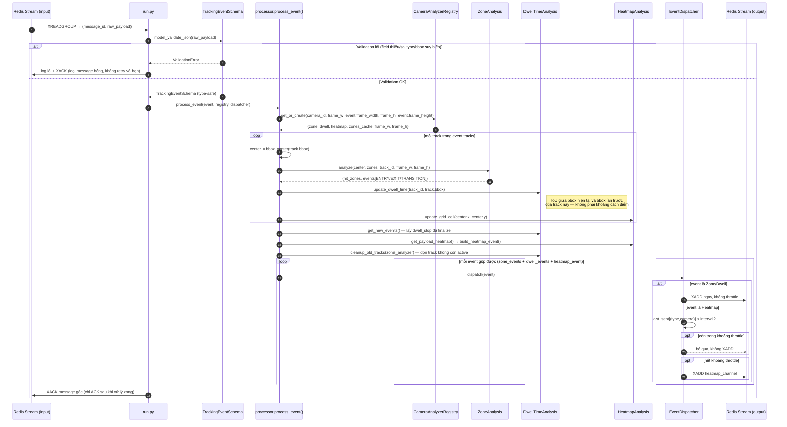

# Analytics Service

## 1. Service Overview

`analytics_service` tiêu thụ `tracking_events` — track ID (đã ổn định qua ReID) + bounding box do
`tracking_service` publish — và suy luận hành vi theo camera: vào/ra vùng quan tâm (**Zone**),
đứng lại bao lâu tại 1 vị trí (**Dwell Time**), mật độ di chuyển tích luỹ theo thời gian
(**Heatmap**). Service **không detect, không track** — mọi input đã là track ID + bbox có sẵn.
Là 1 pure Redis Streams worker (consumer group), không expose HTTP API.

Mỗi camera có 3 analyzer (`ZoneAnalysis`, `DwellTimeAnalysis`, `HeatmapAnalysis`) cách ly hoàn
toàn qua `CameraAnalyzerRegistry` (dict theo `camera_id`, lazy-init khi camera xuất hiện lần đầu).

### 1.1. Sơ đồ luồng xử lý tổng thể



### 1.2. Sơ đồ tuần tự — xử lý 1 tracking event



---

## 2. Tham số cấu hình & ngưỡng nghiệp vụ

Các sơ đồ ở mục 1 mô tả **luồng xử lý**, không liệt kê giá trị số cụ thể — toàn bộ ngưỡng/tham số
dùng trong luồng đó được gom vào bảng dưới đây để tiện tra cứu:

| Tham số | Giá trị | Ý nghĩa | Cấu hình qua |
|---|---|---|---|
| `DWELL_IOU_THRESHOLD` | `0.7` | Ngưỡng IoU giữa 2 bbox liên tiếp để coi là "đứng yên" | `.env` (xem [§5](#5-environment-variables)) |
| `DWELL_TIME_THRESHOLD_SEC` | `2.0` giây | Thời gian đứng yên tối thiểu để tính là 1 sự kiện `dwell_stop` | `.env` (xem [§5](#5-environment-variables)) |
| `HEATMAP_PUBLISH_INTERVAL_SEC` | `10.0` giây | Khoảng thời gian tối thiểu giữa 2 lần publish heatmap cho cùng 1 camera | `.env` (xem [§5](#5-environment-variables)) |
| `grid_size` (HeatmapAnalysis) | `40` px | Kích thước 1 ô lưới heatmap | Hardcode `HeatmapAnalysis.__init__` |
| `decay` (HeatmapAnalysis) | `0.99998` | Hệ số suy giảm "nhiệt" mỗi lần cập nhật (nhân vào toàn bộ ma trận) | Hardcode `HeatmapAnalysis.__init__` |
| `max_age` (dọn track cũ) | `300` giây | Track không cập nhật quá lâu thì bị xoá khỏi state dwell + zone | Hardcode `DwellTimeAnalysis.cleanup_old_tracks()` (tham số mặc định) |

**Lưu ý:** 3 tham số đầu **có thể chỉnh qua `.env`** mà không cần sửa code; 3 tham số còn lại
(kích thước lưới heatmap, hệ số suy giảm, tuổi tối đa của track) hiện hardcode trong code.

---

## 3. Project Structure

```
analytics_service/
├── main.py                          # Entry point — vòng lặp reconnect Redis vô hạn
├── .env                             # Cấu hình instance, đọc qua app/config.py
├── requirements.txt
├── Dockerfile
└── app/
    ├── config.py                    # Pydantic Settings — đọc .env
    ├── run.py                       # Orchestrator: khởi tạo mọi thành phần, vòng lặp đọc/xử lý
    ├── processor.py                 # process_event() — logic xử lý 1 message (1 frame của 1 camera)
    │                                 # build + dispatch cả zone/dwell/heatmap event mỗi frame
    ├── communication/
    │   ├── redis_consumer.py        # XREADGROUP wrapper (RedisConsumer)
    │   ├── redis_producer.py        # XADD wrapper (RedisProducer)
    │   └── event_dispatcher.py      # Route event ra đúng stream theo type, throttle heatmap
    ├── core/
    │   ├── redis.py                 # Redis connection pool (dùng chung consumer + producer)
    │   ├── analyzer_registry.py     # Cache 3 analyzer (zone/dwell/heatmap) theo camera_id
    │   ├── zone_analysis.py         # Point-in-polygon → ENTRY/EXIT/TRANSITION
    │   ├── dwelltime_analysis.py    # IoU liên tiếp trên bbox → dwell time
    │   └── heatmap_analysis.py      # Grid + decay
    ├── schemas/
    │   ├── tracking_event.py        # TrackingEventSchema — validate input
    │   └── analytics_event.py       # ZoneEventPayload / DwellEventPayload / HeatmapEventPayload — output
    └── utils/
        ├── event_builders.py        # dict thô (từ core/) → Pydantic payload chuẩn
        └── zone_provider.py         # Nguồn zone — hardcode tạm thời, chỉ có cam_01
```

**Nhận xét kiến trúc:** tách lớp rõ ràng — `core/` là logic thuần (không biết gì về Redis),
`communication/` là I/O, `schemas/` là hợp đồng dữ liệu, `utils/` là hàm chuyển đổi. `ZoneProvider`
giữ interface ổn định (`get_zones(camera_id)`) để sau này thay bằng nguồn zone thật từ `MODULE_BE`
mà không cần đổi code gọi ở `CameraAnalyzerRegistry`.

---

## 4. Dependencies

Từ `requirements.txt`:

| Package | Vai trò |
|---|---|
| `pydantic` / `pydantic-settings` | Validate input (`TrackingEventSchema`) + output schema + đọc config từ `.env` |
| `python-dotenv` | Hỗ trợ `pydantic-settings` đọc `.env` |
| `redis` | Client Redis — consumer group (input) + producer (3 stream output) |
| `numba` | JIT compile `calculate_iou()` (`@jit(nopython=True)`) — tính IoU tần suất cao mỗi track mỗi frame |
| `numpy` | Ma trận heatmap, mảng bbox cho `calculate_iou` |
| `opencv-python-headless` | `cv2.pointPolygonTest` (zone check), `cv2.polylines`/`putText` (vẽ debug zone) |
| `fastapi` | **Khai báo nhưng chưa dùng** — service là pure Redis worker, không có route/app nào định nghĩa |
| `uvicorn[standard]` | **Khai báo nhưng chưa dùng** — không có ASGI app nào được chạy trong service này |

**Lưu ý:** `fastapi`/`uvicorn` nhiều khả năng sót lại từ việc copy `requirements.txt` chung với
`tracking_service` (service có HTTP API thật) lúc khởi tạo project — không phải bug ảnh hưởng
runtime, chỉ là dependency thừa.

---

## 5. Environment Variables

Đọc qua `app/config.py` (`pydantic-settings`, `env_file=".env"`, cùng cấp thư mục service):

| Biến | Default | Ý nghĩa |
|---|---|---|
| `MODULE_NAME` | `Analytics Service` | Tên module |
| `VERSION` | `1.0.0` | Version |
| `REDIS_URL` | `redis://localhost:6379/0` | Kết nối Redis — trong `docker-compose.yml` override thành `redis://redis:6379` (tên service trong mạng Docker, không phải `localhost`) |
| `REDIS_EXPIRE_TIME` | `3600` | Khai báo trong `Settings` nhưng **không được dùng ở đâu trong `analytics_service`** (TTL vector ReID là khái niệm của `tracking_service`, không áp dụng ở đây) |
| `REDIS_INPUT_STREAM` | `tracking_events` | Stream input — đọc track/bbox từ `tracking_service` |
| `REDIS_INPUT_GROUP` | `analytics_group` | Tên consumer group khi `XREADGROUP` |
| `REDIS_INPUT_CONSUMER` | `consumer-1` | Tên consumer trong group — cố định, chưa hỗ trợ scale nhiều instance với tên khác nhau |
| `REDIS_ZONE_EVENT_STREAM` | `zone_analysis_event_channel` | Stream output — sự kiện ENTRY/EXIT/TRANSITION |
| `REDIS_DWELL_EVENT_STREAM` | `dwell_time_channel` | Stream output — sự kiện dừng đủ lâu (`dwell_stop`) |
| `REDIS_HEATMAP_STREAM` | `heatmap_channel` | Stream output — snapshot ma trận heatmap, throttle theo `HEATMAP_PUBLISH_INTERVAL_SEC` |
| `DEFAULT_FRAME_WIDTH` | `640` | Fallback cho lý thuyết event thiếu `frame_width` (không nên xảy ra — schema đã bắt buộc field này); khớp kích thước letterbox cố định 640×640 mà `tracking_service` luôn dùng, **không phải** độ phân giải gốc camera |
| `DEFAULT_FRAME_HEIGHT` | `640` | Tương tự `DEFAULT_FRAME_WIDTH`, cho chiều cao |
| `HEATMAP_PUBLISH_INTERVAL_SEC` | `10.0` | Khoảng thời gian tối thiểu giữa 2 lần `XADD` heatmap cho cùng 1 camera |
| `DWELL_IOU_THRESHOLD` | `0.7` | Ngưỡng IoU giữa 2 bbox liên tiếp để coi là "đứng yên" (không di chuyển đáng kể) |
| `DWELL_TIME_THRESHOLD_SEC` | `2.0` | Thời gian đứng yên tối thiểu (giây) để tính là 1 sự kiện `dwell_stop` |
