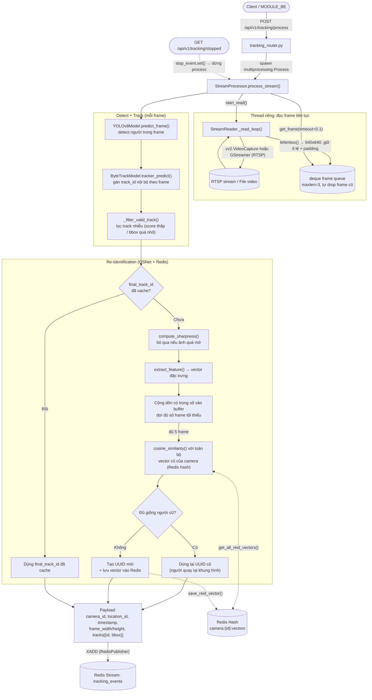
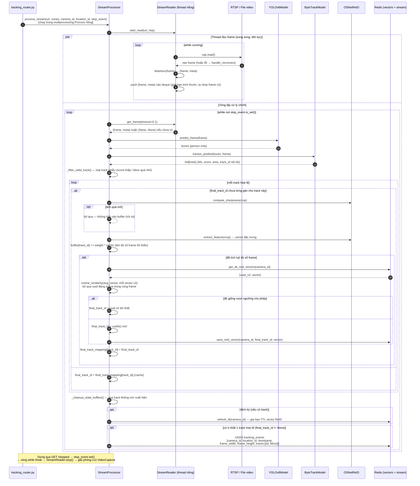

# Tracking Service

## 1. Service Overview

`tracking_service` là service AI xử lý video stream theo thời gian thực (RTSP hoặc file video) cho
từng camera: phát hiện người (YOLOv8), theo dấu (track) đối tượng qua các frame liên tiếp
(ByteTrack), và tái định danh (Re-Identification) đối tượng bị mất dấu tạm thời bằng vector đặc
trưng OSNet + so khớp cosine similarity lưu trong Redis. Kết quả cuối cùng — `track_id` ổn định
(UUID) + bounding box — được publish lên Redis Stream `tracking_events` để `analytics_service`
tiêu thụ. Service không tự lưu trữ lâu dài, không phân tích hành vi (zone/dwell/heatmap) — đó là
trách nhiệm của `analytics_service`.

Mỗi stream (1 camera) chạy trong **1 process riêng** (`multiprocessing.Process`), điều khiển qua
REST API (`start` / `stop` / `status`) — không phải 1 vòng lặp toàn cục xử lý nhiều camera.

### 1.1. Sơ đồ luồng xử lý tổng thể



### 1.2. Sơ đồ tuần tự — vòng đời xử lý 1 frame



---

## 2. Tham số cấu hình & ngưỡng nghiệp vụ

Các sơ đồ ở mục 1 mô tả **luồng xử lý**, không liệt kê giá trị số cụ thể — toàn bộ ngưỡng/tham số
dùng trong luồng đó được gom vào bảng dưới đây để tiện tra cứu:

| Tham số | Giá trị | Ý nghĩa | Cấu hình qua |
|---|---|---|---|
| `confidence_threshold` (YOLOv8) | `0.4` | Ngưỡng tin cậy tối thiểu để giữ 1 detection | `yolov8.config.yaml` (`YOLOV8_CONFIG_PATH`) |
| `iou_threshold` (YOLOv8 NMS) | `0.45` | Ngưỡng IoU loại bbox trùng nhau (Non-Max Suppression) | `yolov8.config.yaml` |
| `classes` | `0` (person) | Chỉ detect class "person" | `yolov8.config.yaml` |
| `track_high_thresh` / `track_low_thresh` / `new_track_thresh` (ByteTrack) | `0.4` / `0.05` / `0.5` | Ngưỡng score để match track hiện có / xét match track điểm thấp / tạo track mới | `bytetrack.config.yaml` |
| `track_buffer` (ByteTrack) | `60` frame | Số frame giữ track "mất dấu" trước khi xoá hẳn | `bytetrack.config.yaml` |
| `match_thresh` (ByteTrack) | `0.6` | Ngưỡng IoU để match track giữa 2 frame liên tiếp | `bytetrack.config.yaml` |
| `frame_rate` (ByteTrack) | `7` | FPS giả định, dùng để quy đổi `track_buffer` theo thời gian thực | `bytetrack.config.yaml` |
| `track_threshold` | `0.6` | Lọc bỏ track có score thấp (nhiễu) trước khi đưa vào ReID | Hardcode `StreamProcessor.__init__` |
| `track_area` | `500` px² | Lọc bbox quá nhỏ (nhiễu / vật ở quá xa camera) | Hardcode `StreamProcessor.__init__` |
| `sharpness_threshold` | `0.3` | Bỏ qua crop ảnh quá mờ khi trích vector ReID | Hardcode `StreamProcessor.__init__` |
| `distance_threshold` (ReID match) | `0.82` | Ngưỡng cosine similarity để coi 2 vector là "cùng 1 người" | Hardcode `StreamProcessor.__init__` |
| Số frame tích luỹ vector ReID | `5` | Số frame gộp trọng số trước khi so khớp / tạo ID mới | Hardcode `_resolve_identity()` (`count < 5`) |
| `target_size` (letterbox) | `640×640` | Kích thước chuẩn hoá frame trước khi đưa vào YOLO — cũng là không gian toạ độ của mọi bbox track | Hardcode `StreamProcessor.process_stream()` (khởi tạo `StreamReader`) |
| `queue_size` (deque frame buffer) | `3` | Số frame tối đa giữ trong buffer trước khi tự drop frame cũ | Hardcode `StreamProcessor.process_stream()` |
| Chu kỳ `refresh_ttl` | `10` giây | Định kỳ gia hạn TTL vector ReID trong Redis khi còn track hoạt động | Hardcode `StreamProcessor.process_stream()` (vòng lặp chính) |
| `maxlen` (RedisPublisher) | `100` | Giới hạn độ dài tối đa stream `tracking_events` (`XADD ... MAXLEN`) | Hardcode `RedisPublisher.__init__` |
| Reconnect backoff (RTSP) | bắt đầu `2s`, nhân đôi mỗi lần thất bại, tối đa `60s`; 5 lần đầu retry ngay không chờ | Chiến lược tự kết nối lại khi mất RTSP stream | Hardcode `handle_reconnect()` (`connection_utils.py`) |

**Lưu ý:** phần lớn các tham số này **không đi qua `.env`** — muốn đổi phải sửa trực tiếp code
(`StreamProcessor.__init__`) hoặc file YAML tương ứng (`yolov8.config.yaml`/`bytetrack.config.yaml`).

---

## 3. Project Structure

```
tracking_service/
├── run.py                            # Entry point — chạy uvicorn server (FastAPI)
├── Justfile                          # Task runner (dev/build shortcuts)
├── Dockerfile                        # Base python:3.10-slim + libgl1/libglib2.0 cho OpenCV
├── .dockerignore
├── .env                              # Cấu hình instance, đọc qua app/config.py
├── requirements.txt
├── weights/
│   ├── yolov8m.pt                    # Model gốc (không dùng trực tiếp — export sang OpenVINO)
│   ├── yolov8m_openvino_model/       # Model YOLOv8 đã export OpenVINO — dùng thật (yolov8.config.yaml)
│   └── osnet_x1_0.onnx               # Model OSNet ReID (ONNX, chạy qua OpenVINO runtime)
├── scripts/
│   ├── export_onnx.py                # Script export model sang ONNX
│   └── export_yolo_openvino.py       # Script export YOLOv8 sang OpenVINO IR
└── app/
    ├── main.py                       # FastAPI app: lifespan (startup checks) + router
    ├── startup.py                    # Health-check banner lúc khởi động: Redis/YOLO/OSNet
    ├── config.py                     # Pydantic Settings — đọc .env
    ├── configs/
    │   ├── yolov8.config.yaml        # model_path, confidence/iou threshold, classes
    │   └── bytetrack.config.yaml     # threshold + track_buffer + frame_rate cho ByteTrack
    ├── api/v1/
    │   └── tracking_router.py        # POST /process, GET /status, GET /stopped
    │                                  # quản lý vòng đời multiprocessing.Process theo url_rtsp
    ├── processing/
    │   ├── stream_processing.py      # StreamProcessor — orchestrator chính: detect→track→ReID→publish
    │   └── stream_reader.py          # StreamReader — thread đọc frame liên tục, tự reconnect RTSP
    ├── core/
    │   ├── yolov8_model.py           # Wrapper Ultralytics YOLO — predict_frame()
    │   ├── bytetrack_model.py        # Wrapper Ultralytics BYTETracker — tracker_predict()
    │   ├── object_tracking.py        # Gộp YOLOv8Model + ByteTrackModel thành 1 bước detect+track
    │   ├── osnet_reid.py             # OSNetReID — trích xuất vector đặc trưng (OpenVINO inference)
    │   └── redis.py                  # Connection pool + get/save/refresh vector ReID theo camera
    ├── communication/
    │   └── redis_publish.py          # RedisPublisher — XADD tracking_events
    └── utils/
        ├── image_utils.py            # letterbox() — resize giữ tỉ lệ + padding về target_size cố định
        ├── connection_utils.py       # handle_reconnect() — retry/backoff cho RTSP mất kết nối
        ├── path_utils.py             # resolve_path() — map đường dẫn video local ↔ container
        ├── math_utils.py             # cosine_similarity()
        ├── visualizer.py             # draw_tracks() — vẽ bbox debug (không publish ra ngoài)
        ├── exception_handle.py       # CustomException + FastAPI exception handlers
        └── logging.py                # setup_logging()
```

**Nhận xét:** kiến trúc tách theo trách nhiệm — `core/` là các model wrapper thuần (YOLO/ByteTrack/
OSNet), `processing/` là logic orchestrate theo camera, `communication/` là I/O ra Redis,
`api/v1/` là lớp điều khiển vòng đời qua HTTP. Mỗi camera = 1 process hệ điều hành riêng, cách ly
hoàn toàn (crash 1 stream không ảnh hưởng stream khác), đổi lại tốn RAM hơn so với threading/asyncio
cho cùng số lượng camera.

---

## 4. Dependencies

Từ `requirements.txt`:

| Package | Vai trò |
|---|---|
| `fastapi` | REST API điều khiển stream (`start`/`stop`/`status`) |
| `uvicorn[standard]` | ASGI server chạy FastAPI |
| `pydantic` / `pydantic-settings` | Validate request body + đọc config từ `.env` |
| `ultralytics` | YOLOv8 (detect) + BYTETracker (track) |
| `torch`, `torchvision` | Runtime backend cho `ultralytics` (dù model thật chạy qua OpenVINO) |
| `opencv-python-headless` | Đọc video/RTSP (`cv2.VideoCapture`), letterbox, vẽ debug bbox |
| `openvino` | Inference engine cho YOLOv8 (export OpenVINO IR) và OSNet ReID (ONNX) — nhanh hơn PyTorch thuần trên CPU |
| `pyyaml` | Đọc `yolov8.config.yaml` / `bytetrack.config.yaml` |
| `python-dotenv` | Hỗ trợ `pydantic-settings` đọc `.env` |
| `redis` | Client Redis — publish tracking event + lưu/truy vấn vector ReID |
| `numpy` | Xử lý mảng ảnh, vector đặc trưng, tính cosine similarity |

**Phụ thuộc hệ thống (ngoài `pip`, khai báo trong `Dockerfile`):** `libgl1`, `libglib2.0-0` —
thư viện native bắt buộc để `opencv-python-headless` chạy được trên base image Debian slim.

**Phụ thuộc dữ liệu (không qua `pip`, phải có sẵn trong `weights/`):**
- `weights/yolov8m_openvino_model/` — model detect người, export sẵn dạng OpenVINO IR.
- `weights/osnet_x1_0.onnx` — model trích xuất vector ReID 512 chiều.

**RTSP qua GStreamer (tuỳ chọn):** `StreamReader` thử pipeline GStreamer trước (`cv2.CAP_GSTREAMER`)
nếu OpenCV được build kèm GStreamer support, tự động fallback về `cv2.VideoCapture` mặc định nếu
không có — không phải dependency bắt buộc.

---

## 5. Environment Variables

Đọc qua `app/config.py` (`pydantic-settings`, `env_file=".env"`, cùng cấp thư mục service):

| Biến | Default | Ý nghĩa |
|---|---|---|
| `MODULE_NAME` | `Tracking Service` | Tên module, hiển thị trong banner startup |
| `VERSION` | `1.1.2` | Version hiển thị trong banner startup |
| `APP` | `gpu` | Cờ đánh dấu môi trường chạy (hiện chưa thấy code nào đọc giá trị này để rẽ nhánh logic) |
| `YOLOV8_CONFIG_PATH` | `app/configs/yolov8.config.yaml` | Đường dẫn file YAML cấu hình YOLOv8 (model path, threshold, classes) |
| `BYTETRACK_CONFIG_PATH` | `app/configs/bytetrack.config.yaml` | Đường dẫn file YAML cấu hình ByteTrack |
| `AI_PORT` | `8000` | Port FastAPI lắng nghe |
| `RELOAD` | `true` (local) / `false` (Docker, override cứng trong `Dockerfile`) | Bật `uvicorn --reload` khi dev |
| `REDIS_URL` | `redis://localhost:6379/0` | Kết nối Redis — trong `docker-compose.yml` được override thành `redis://redis:6379` (tên service, không phải `localhost`) |
| `REDIS_EXPIRE_TIME` | `3600` | TTL (giây) cho Redis hash lưu vector ReID mỗi camera — refresh mỗi 10s khi còn track hoạt động |
| `VIDEO_SOURCE` | `storage/videos/video_1.mp4` | Giá trị mặc định tham khảo — **không được code nào đọc trực tiếp**, `url_rtsp` thực tế luôn truyền qua body của `POST /api/v1/tracking/process` |

**Lưu ý — biến chưa được config hoá:** `OSNET_MODEL_PATH = "weights/osnet_x1_0.onnx"` bị hardcode
trực tiếp trong `app/startup.py` (không đọc qua `Settings`), khác với `YOLOV8_CONFIG_PATH`/
`BYTETRACK_CONFIG_PATH` đã có trong config. Các ngưỡng nghiệp vụ khác (score/area/sharpness/ReID
threshold, letterbox size, v.v.) cũng hardcode trong code — xem bảng đầy đủ ở [§2](#2-tham-số-cấu-hình--ngưỡng-nghiệp-vụ).
