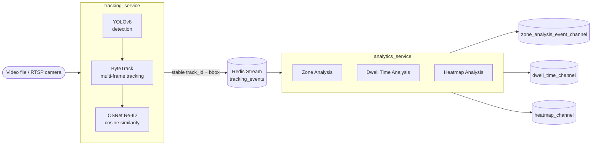

<div align="center">

# 🛰️ SpaceLens — Core AI

**Real-time space & behavior analytics from camera streams — detection, tracking, re-identification, and zone/dwell/heatmap analysis.**

[](https://hub.docker.com/repositories/khanhduysun)


</div>

---

## Overview

SpaceLens is a real-time AI system for space/behavior analytics (retail & space analytics) from
camera feeds: person detection, multi-frame tracking, re-identification (Re-ID) after temporary
occlusion, and behavior inference — zone entry/exit, dwell time, and cumulative movement density
(heatmap).

> **Current status:** the project is currently focused on the **Core AI** layer (`MODULE_AI`).
> Backend (`MODULE_BE`) and Frontend (`MODULE_FE`) are not implemented yet — both are still
> scaffolding and will later consume the data Core AI publishes to Redis Streams.

## Architecture



| Service | Responsibility | Communication | Exposure |
|---|---|---|---|
| `tracking_service` | Detect (YOLOv8) + Track (ByteTrack) + Re-ID (OSNet) per camera | Publishes `tracking_events` to Redis | REST API (start/stop/status) |
| `analytics_service` | Infers behavior from tracking events (Zone/Dwell/Heatmap) | Consumes Redis Streams (consumer group) | No HTTP exposure — pure worker |
| `redis` | Message broker between the two services | Redis Streams | Port `6379` |

- 📊 **Detailed diagrams:** [tracking_service](docs/diagram_ai_tracking.md) ·
  [analytics_service](docs/diagram_ai_analysis.md)
- 📄 **Per-service docs:** [tracking_service](MODULE_AI/tracking_service/README.md) ·
  [analytics_service](MODULE_AI/analytics_service/README.md)

## Core Features

- **Decoupled detection/tracking from behavior analysis** — the two services communicate purely
  through Redis Streams, with no direct dependency, making them easy to scale independently.
- **Resilient Re-Identification** — OSNet + cosine similarity keeps the same `track_id` when a
  person leaves and re-enters the frame, instead of being counted as a new person.
- **Parallel multi-camera processing** — each camera stream runs in its own process
  (`multiprocessing`), controlled dynamically through a REST API instead of one global loop.
- **3 independent behavior analyzers per camera** — Zone, Dwell Time, Heatmap, lazily initialized
  via `CameraAnalyzerRegistry`.
- **Per-service packaging & CI/CD** — each service has its own `Dockerfile` and build/deploy
  pipeline, fully isolated from the others.

## Prerequisites

- Python 3.10+ (a separate venv per service is recommended)
- Docker + Docker Compose
- Redis (local install or via Docker)
- [`just`](https://github.com/casey/just) — optional, used to run shortcuts defined in each `Justfile`
- GPU + CUDA — optional, speeds up YOLOv8/OSNet inference (services also run fine on CPU)

## Getting Started

### `.env` configuration

Create a `.env` file at the project root (do not commit it to git):

```env
NODE_ENV=development
REDIS_URL=redis://localhost:6379
AI_PORT=8000
```

When running via Docker Compose, `REDIS_URL` is automatically overridden to `redis://redis:6379`
(pointing to the internal Redis container) — the value in `.env` only applies when running a
service directly on your local machine.

### Run with Docker Compose (Recommended)

Build and run the whole stack (Redis + tracking + analytics) with a single command, from the
project root:

```bash
docker compose up --build          # foreground
docker compose up -d --build       # detached
docker compose logs -f ai-tracking # tail logs
docker compose down                # stop
```

Services defined in [docker-compose.yml](docker-compose.yml):

| Service | Container | Port | Role |
|---|---|---|---|
| `redis` | spacelens-redis | 6379 | Message broker (Redis Streams) |
| `ai-tracking` | ai-tracking-services | `AI_PORT` (default 8000) | Detect + Track + Re-ID, exposes REST API |
| `ai-analytics` | ai-analytics-analytics | — | Consumer, behavior analysis, no exposed port |

**Use prebuilt images from Docker Hub** (no local build needed) — images are built & pushed
automatically by CI on every push to `dev`/`main`: 👉 https://hub.docker.com/repositories/khanhduysun

```bash
docker pull khanhduysun/tracking-service:<tag>
docker pull khanhduysun/analysis-service:<tag>
```
`<tag>` is the short commit SHA (visible in the image name on Docker Hub or in the corresponding
GitHub Actions run log).

### Run Locally (Dev Environment)

Use this when you need to debug directly with your IDE/breakpoints.

**1. Start Redis** (if not already installed, run it quickly via Docker):
```bash
docker run -d --name redis -p 6379:6379 redis:7.2-alpine
```

**2. Run `tracking_service`** (terminal 1):
```bash
cd MODULE_AI/tracking_service
pip install -r requirements.txt
python run.py            # or: just install && just run
```
By default the service runs at `http://localhost:8000`.

**3. Run `analytics_service`** (terminal 2):
```bash
cd MODULE_AI/analytics_service
pip install -r requirements.txt
python main.py           # or: just install && just run
```
This is a pure worker (Redis Streams consumer) — it does not expose an HTTP port.

## API Reference & Usage

`tracking_service` exposes a REST API at `http://localhost:<AI_PORT>` (default `8000`), with an
interactive Swagger UI at **`/docs`**.

| Method | Endpoint | Description | Body / Query |
|---|---|---|---|
| `POST` | `/api/v1/tracking/process` | Start processing a stream (video file or RTSP) | `{ "url_rtsp": string, "camera_id"?: string, "location_id"?: string, "list_zone"?: [{zone_id, points}] }` |
| `GET` | `/api/v1/tracking/status` | Get status of one or all running streams | `?url_rtsp=` (omit to list all) |
| `GET` | `/api/v1/tracking/stopped` | Stop a running stream | `?url_rtsp=` (required) |

> ⚠️ **Note:** any `url_rtsp` containing the string `"MODULE_AI/storage"` is **automatically
> remapped** to `/app/storage/...` — this is only correct when running via Docker (thanks to the
> volume mount). See the environment-specific instructions below.

### Testing with a local video — via Docker

The `ai-tracking` container mounts `MODULE_AI/storage` (read-only) into `/app/storage`:
```yaml
volumes:
  - ./MODULE_AI/storage:/app/storage:ro
```
1. Place your test video under `MODULE_AI/storage/videos/` (e.g. `video_1.mp4`).
2. Call the API with a path starting with `MODULE_AI/storage/...` — it gets auto-remapped to the
   container path:
```bash
curl -X POST http://localhost:8000/api/v1/tracking/process \
  -H "Content-Type: application/json" \
  -d '{ "url_rtsp": "MODULE_AI/storage/videos/video_1.mp4", "camera_id": "cam_01" }'
```
For a real camera, just replace `url_rtsp` with an RTSP address (`rtsp://...`) — no video mount
needed.

### Testing with a local video — running locally (no Docker)

There is no volume mount, so **avoid any path containing `MODULE_AI/storage`** (it will be
remapped incorrectly). Point directly to the real path of the video on your machine:
```bash
curl -X POST http://localhost:8000/api/v1/tracking/process \
  -H "Content-Type: application/json" \
  -d '{ "url_rtsp": "D:/videos/test_1.mp4", "camera_id": "cam_01" }'
```

### Checking / stopping a stream

```bash
curl "http://localhost:8000/api/v1/tracking/status?url_rtsp=<url_rtsp used at start>"
curl "http://localhost:8000/api/v1/tracking/stopped?url_rtsp=<url_rtsp used at start>"
```

Once `tracking_service` publishes `tracking_events`, `analytics_service` automatically consumes
them and pushes results to `zone_analysis_event_channel`, `dwell_time_channel`, and
`heatmap_channel` — observable via `redis-cli XREAD` or RedisInsight.

## CI/CD & Deployment

Each service has its own workflow (`tracking-service.yml`, `analysis-service.yml`), both calling a
shared **reusable workflow** [`_service-ci.yml`](.github/workflows/_service-ci.yml) to avoid
duplicating the Docker build/push logic.

| Trigger | Condition | Action |
|---|---|---|
| `pull_request` → `dev`/`main` | PR changes files under the service's path | Build & test (no deploy) |
| `push` → `dev`/`main` | Merge into `dev` or `main` | Build, push image to Docker Hub, run the `deploy` job |

- Each workflow only triggers when the change is within that specific service's path (`paths:`
  filter) — avoiding unnecessary builds when a PR only touches another service.
- A `concurrency` group keyed by `github.ref` with `cancel-in-progress: true` prevents overlapping
  deploys when multiple commits are pushed in quick succession.
- Images are built & pushed to Docker Hub: 👉 https://hub.docker.com/repositories/khanhduysun

## Project Structure

```
MODULE_AI/
  tracking_service/    # Detect (YOLOv8) + Track (ByteTrack) + Re-ID (OSNet)
  analytics_service/   # Zone / Dwell-time / Heatmap analysis
  storage/              # Test videos, mounted into the ai-tracking container
MODULE_BE/              # (not implemented yet)
MODULE_FE/              # (not implemented yet)
docs/                    # Detailed architecture diagrams
.github/workflows/       # CI/CD — reusable workflow + per-service pipelines
docker-compose.yml       # Orchestration: redis + ai-tracking + ai-analytics
```
