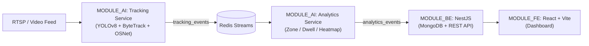

# SpaceLens

> Real-time space and human behavior analytics platform from camera streams.

---

## 1. Overview

SpaceLens integrates computer vision models with an event-driven architecture and a centralized management web application:
- **Tracking & Re-ID:** Person detection (YOLOv8), multi-object tracking (ByteTrack), and appearance-based re-identification across occlusions (OSNet Re-ID).
- **Behavior Analytics:** Zone entry/exit monitoring, dwell time calculation, and cumulative movement heatmaps.
- **Management Platform:** Standardized NestJS backend with MongoDB integration, Swagger documentation, and a responsive React frontend dashboard.

---

## 2. System Architecture



### Module Responsibilities:

| Module | Core Stack | Responsibility |
| :--- | :--- | :--- |
| `MODULE_AI/tracking_service` | Python, YOLOv8, ByteTrack, OSNet, FastAPI | Ingests video streams, detects and tracks individuals with persistent track IDs, publishes events to Redis. |
| `MODULE_AI/analytics_service` | Python, Redis Streams | Consumes Redis stream events to compute dwell time, zone statistics, and density heatmaps. |
| `MODULE_BE` | NestJS, TypeScript, MongoDB (Mongoose) | Manages camera registries, configuration, data persistence, and exposes RESTful APIs. |
| `MODULE_FE` | React, Vite, TailwindCSS | Provides administration dashboard for camera feeds, analytic visualizations, and zone configuration. |

---

## 3. Directory Structure

```text
spacelensproject/
├── MODULE_AI/
│   ├── tracking_service/     # Object detection and tracking pipeline
│   ├── analytics_service/    # Behavior analytics workers (zone, dwell, heatmap)
│   └── storage/              # Test video footage
├── MODULE_BE/                 # NestJS backend (REST API, MongoDB, Swagger)
├── MODULE_FE/                 # React frontend dashboard
├── docs/                      # Technical specifications and design documents
├── docker-compose.yml         # Container orchestration for Redis and AI services
└── README.md
```

---

## 4. Getting Started

### Prerequisites
- Node.js (v18+) and npm
- Python 3.10+
- Docker & Docker Compose

Create a root `.env` file:
```env
NODE_ENV=development
REDIS_URL=redis://localhost:6379
PORT=3000
MONGODB_URI=mongodb+srv://<username>:<password>@cluster.mongodb.net/spacelens
```

### Running Backend (MODULE_BE)
```bash
cd MODULE_BE
npm install
npm run start:dev
```
- Base API URL: `http://localhost:3000/api/v1`
- Swagger API Docs: `http://localhost:3000/api/v1/docs`
- Health Check: `http://localhost:3000/api/v1/healthy`

### Running Frontend (MODULE_FE)
```bash
cd MODULE_FE
npm install
npm run dev
```
- Web Application: `http://localhost:5173`

### Running AI Services (Docker)
```bash
docker compose up -d
```

---

## 5. Core REST APIs (Camera Module)

| Method | Endpoint | Description |
| :--- | :--- | :--- |
| `POST` | `/api/v1/cameras` | Register a new camera in the system |
| `GET` | `/api/v1/cameras/all` | Retrieve paginated camera list with search and filter capabilities |
| `GET` | `/api/v1/cameras/:id` | Get detailed information for a single camera |
| `PATCH` | `/api/v1/cameras/:id` | Update camera configuration by ID |
| `DELETE` | `/api/v1/cameras/:id` | Remove a camera from the system |
| `GET` | `/api/v1/healthy` | System health check and uptime verification |

---

## 6. Author and Project Information
- **Author:** Nguyen Khanh Duy
- **Project:** Scientific Research (NCKH) - SpaceLens Platform
