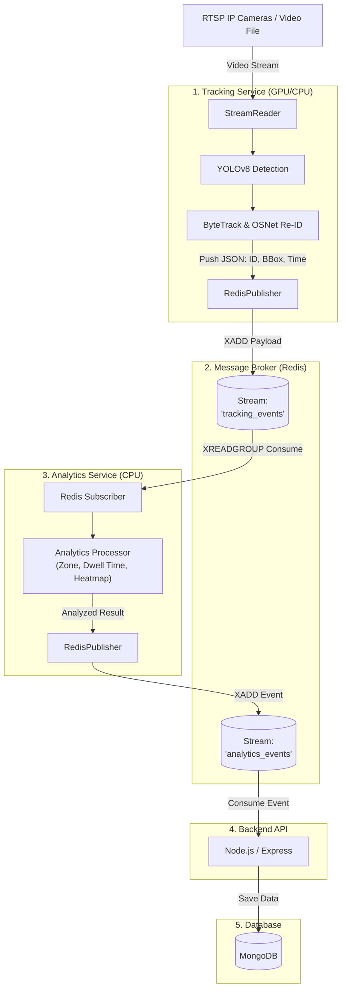
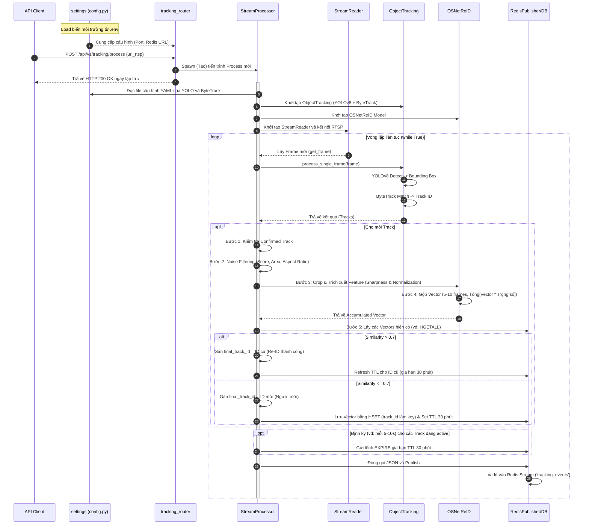
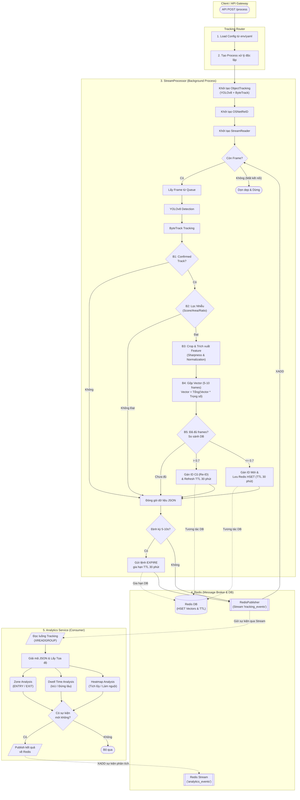

# Sơ Đồ Hoạt Động & Kiến Trúc Dự Án

Tài liệu này cung cấp cái nhìn toàn cảnh về kiến trúc của toàn bộ dự án SpaceLens, cũng như luồng hoạt động chi tiết của từng service.

## 1. Sơ Đồ Kiến Trúc Tổng Thể Toàn Dự Án
Sơ đồ này thể hiện luồng dữ liệu đi từ Camera, qua các module AI, cho đến Backend và Database. Analytics Service được đóng gói thành một khối tổng quát.

## 2. Sơ đồ Tuần tự (Sequence Diagram) - Tracking Service
Sơ đồ này thể hiện rõ thứ tự các bước bên trong luồng xử lý nhận diện AI.

## 3. Sơ đồ Khối (Flowchart / Activity Diagram) - Tích hợp Swimlane
Sơ đồ này nhấn mạnh vào luồng xử lý dữ liệu (Data flow) bao gồm pipeline 4 bước của OSNet.

## 4. Chú giải Chi tiết Các Bước (Pipeline OSNet Re-ID)

Bảng dưới đây giải thích chi tiết các bước được thể hiện trong hai sơ đồ trên, đặc biệt tập trung vào cơ chế Re-ID và tương tác với Redis:

| Bước | Tên Giai Đoạn | Mô tả Chi tiết |
| :--- | :--- | :--- |
| **B1** | **Kiểm tra Confirmed Track** | ByteTrack sẽ gán trạng thái cho mỗi bounding box. Chỉ các đối tượng có trạng thái `Confirmed` (tồn tại ổn định qua nhiều frame) mới được cho phép đi tiếp. |
| **B2** | **Lọc Nhiễu (Noise Filtering)** | Loại bỏ các bounding box kém chất lượng dựa trên:  - **Score**: Độ tự tin của YOLO (VD: > 0.6). - **Area**: Diện tích box phải đủ lớn (tính bằng `width * height`). - **Ratio**: Tỉ lệ khung hình tính bằng `W/H` (chiều rộng / chiều cao của bounding box). |
| **B3** | **Crop & Trích xuất Feature** | Cắt hình ảnh đối tượng, đưa qua AI **OSNet** để lấy Feature Vector. Trải qua 2 bước nhỏ:  1. **Sharpness**: Tính điểm độ nét của ảnh. 2. **Normalization**: Chuẩn hóa điểm số này thành trọng số (weight). |
| **B4** | **Gộp Vector (Accumulation)** | Thu thập và gộp vector của đối tượng qua **5 - 10 frames** để có vector ổn định nhất. Công thức: `Vector cuối cùng = Tổng các (Vector khung hình * Trọng số)`. |
| **B5** | **So sánh & Lưu trữ (Redis)** | Khi đã gộp đủ frames (qua B4). Lấy các vector trong Redis (bằng `HGETALL`) để tính khoảng cách Cosine:  - **> 0.7**: Là người cũ. Lấy lại ID cũ và gia hạn thời gian sống (TTL) thêm 30 phút.  - **<= 0.7**: Là người mới. Tạo ID mới, lưu Vector vào Redis dưới dạng `HashSet (HSET)` và đặt TTL 30 phút. |
| **Refresh** | **Gia hạn TTL Định kỳ** | Trong quá trình hệ thống đang tracking liên tục, một tiến trình phụ sẽ định kỳ (VD: 5-10s) gọi lệnh `EXPIRE` lên Redis để liên tục làm tươi thời gian sống cho các ID đang hiện diện trên camera, đảm bảo họ không bị Redis xóa nhầm khi đang đứng trước ống kính lâu hơn 30 phút. |
| **Publish** | **Đóng gói JSON & Gửi luồng** | Sau khi chốt được `final_track_id` cho khung hình hiện tại, hệ thống sẽ gom toàn bộ thông tin của đối tượng (bao gồm: `track_id`, tọa độ bounding box, confidence score, class, timestamp,...) thành định dạng JSON và đẩy lên Redis Stream để các dịch vụ khác (như UI, Analytics) tiêu thụ. |

## 5. Phân Tích Sơ Bộ Analytics Service (Module Phân Tích Hành Vi)

Do phần Analytics Service đang trong quá trình nghiên cứu, sơ đồ kiến trúc chỉ thể hiện dưới dạng một khối tổng quát. Dưới đây là phân tích sơ bộ các khối logic bên trong để phục vụ cho việc hoàn thiện sau này:

### A. Các Khối Nghiệp Vụ Chính
1. **Zone Analysis (Vùng Giám Sát & Đếm Người):** Nhận tọa độ đối tượng (point) và kiểm tra tương quan với các đa giác (Polygon). Tự động sinh ra các sự kiện: `ENTRY` (đi vào), `EXIT` (đi ra), `TRANSITION` (chuyển vùng). Đây là cơ sở cốt lõi để làm biểu đồ lưu lượng ra vào (People Counting).
2. **Dwell Time Analysis (Phân Tích Dừng Đỗ):** Sử dụng **IoU** (Intersection over Union) giữa 2 bounding box ở các frame liên tiếp để xác định đối tượng có di chuyển hay không. Nếu đứng yên (IoU > 0.7) quá ngưỡng thời gian quy định (VD: 2.0s), hệ thống sẽ gửi event cảnh báo (`ping` hoặc `stop`). Thuật toán IoU được tăng tốc (JIT compile) bằng thư viện `numba` giúp giảm tải CPU.
3. **Heatmap Analysis (Bản Đồ Nhiệt):** Chia không gian camera thành một ma trận lưới (Grid). Mỗi khi có người đi qua, cell tương ứng cộng thêm cường độ nhiệt. Sử dụng hệ số làm nguội (Decay = 0.99998) để hạ nhiệt từ từ các khu vực không còn người.

