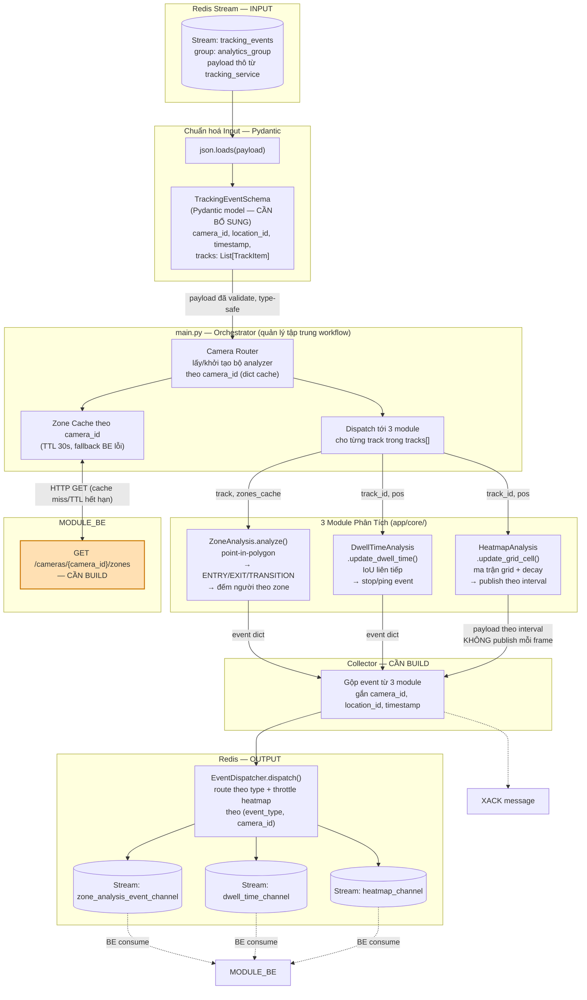
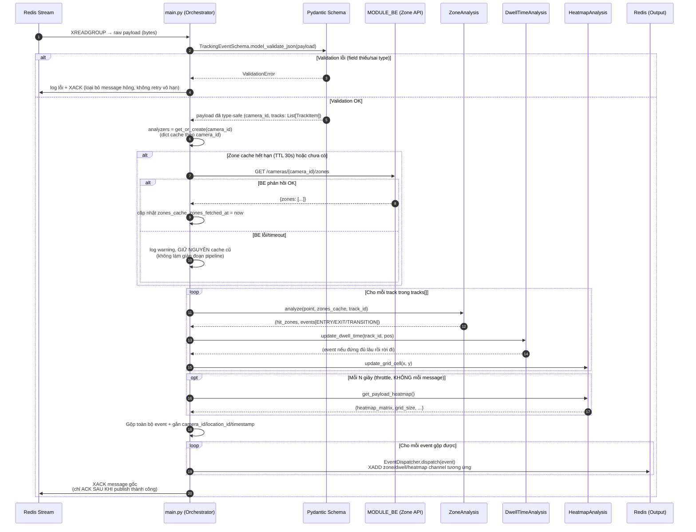

# Kiến Trúc & Luồng Xử Lý — Analytics Service

> Mô tả chi tiết `MODULE_AI/analytics_service` — service chịu trách nhiệm tiêu thụ
> `tracking_events` từ Redis, chạy 3 module nghiệp vụ (Zone, Dwell Time, Heatmap), và publish
> kết quả trở lại Redis cho `MODULE_BE` tiêu thụ. Xem thêm
> [`diagram_ai_tracking.md`](./diagram_ai_tracking.md) cho phần detect/track phía trước, bao
> gồm sơ đồ kiến trúc tổng thể toàn dự án ở đầu tài liệu đó.

---

## 0. Trạng thái triển khai

| Thành phần | Trạng thái |
|---|---|
| Analytics Service — đọc Redis Stream, Consumer Group | ✅ Hoạt động (`app/communication/redis_consumer.py`) |
| Analytics Service — Pydantic validation input | ✅ Hoạt động (`app/schemas/tracking_event.py`) |
| Analytics Service — tích hợp 3 module Zone/Dwell/Heatmap | ✅ Hoạt động, nối vào `main.py` qua `process_event()` |
| Analytics Service — cách ly state theo `camera_id` | ✅ Hoạt động (`app/core/analyzer_registry.py` — dict theo `camera_id`) |
| Analytics Service — publish kết quả ra Redis output | ✅ Hoạt động, tách riêng theo loại qua `EventDispatcher` (`app/communication/event_dispatcher.py`): `zone_analysis_event_channel`, `dwell_time_channel`, `heatmap_channel` — zone/dwell events publish ngay theo từng message (không throttle), heatmap throttle theo `(event_type, camera_id)` với `HEATMAP_PUBLISH_INTERVAL_SEC`, gọi từ `HeatmapPublisher.maybe_publish()` trên cùng thread consumer |
| Analytics Service — nguồn zone polygon | ⚠️ Hardcode tạm thời (`app/core/zone_provider.py`) — chờ `HTTPZoneProvider` khi BE có API |
| Analytics Service — `frame_width`/`frame_height` theo camera thực tế | ⚠️ Dùng giá trị mặc định cấu hình (`DEFAULT_FRAME_WIDTH/HEIGHT`) — `tracking_events` payload chưa mang field này |
| MODULE_BE — domain `camera`/`zone` (model + API) | ❌ Chưa build (chỉ scaffold `.gitkeep`) |

Chi tiết kế hoạch triển khai: `.temps/analytics_service_implementation_plan.md`.

Xem trạng thái phần Tracking Service trong
[`diagram_ai_tracking.md`](./diagram_ai_tracking.md#trạng-thái-triển-khai-toàn-dự-án-tổng-quan-nhanh).

---

## 1. Vai trò trong hệ thống

`analytics_service` là khối "Suy luận & Tính toán" — tách biệt hoàn toàn khỏi
`tracking_service` (xem [`diagram_ai_tracking.md`](./diagram_ai_tracking.md)) để không làm
chậm FPS của luồng video. Nó không detect, không track — chỉ nhận toạ độ + track ID đã có sẵn
và suy luận hành vi (vào/ra vùng, đứng lại bao lâu, mật độ di chuyển ở đâu).

**Hiện trạng:** service đã kết nối được Redis Stream và đọc message, nhưng phần tích hợp 3
module nghiệp vụ vào vòng lặp chính đang **bị comment out**, và phần publish kết quả ra Redis
**hoàn toàn chưa tồn tại**. Tài liệu này mô tả kiến trúc **mục tiêu** (bao gồm phần chưa build)
để làm cơ sở implement.

---

## 2. Sơ đồ tổng thể: Redis → Orchestrator → 3 module phân tích → Redis



**Ô màu cam** = chưa tồn tại trong code hiện tại, là phần cần build. Chi tiết quyết định thiết
kế xem các ADR ở cuối tài liệu.

---

## 3. Sơ đồ tuần tự: xử lý 1 message từ đầu đến cuối



**Nguyên tắc thứ tự quan trọng:** `XACK` chỉ thực hiện **sau khi** toàn bộ xử lý + publish
output thành công — tránh mất dữ liệu nếu publish lỗi giữa chừng (đây là lý do
Consumer Group/Stream được chọn thay vì Pub/Sub: message chưa ACK vẫn còn trong Pending Entries
List, có thể xử lý lại).

---

## 4. Chuẩn hoá input bằng Pydantic — tại sao bắt buộc

**Hiện trạng:** `main.py` hiện xử lý `json.loads(raw_payload)` thành `dict` thô, không có
validation. Toàn bộ 3 module (`ZoneAnalysis`, `DwellTimeAnalysis`, `HeatmapAnalysis`) cũng nhận
tham số dạng nguyên thuỷ (`point`, `track_id`, dict), không có schema thống nhất.

**Rủi ro cụ thể nếu không validate:**
- `tracking_service` publish payload có thể thiếu field (`camera_id=None`, `tracks=[]`) —
  nếu không chặn ở input, lỗi sẽ trồi lên giữa vòng lặp xử lý (`KeyError`/`TypeError`) và có
  thể làm crash toàn bộ worker loop, ảnh hưởng tới mọi camera khác đang dùng chung 1 process.
- Payload hỏng (JSON đúng cú pháp nhưng sai cấu trúc) hiện không có cách nào phân biệt với
  payload hợp lệ cho tới khi chạy sâu vào logic nghiệp vụ.

**Schema đề xuất** (thêm vào `app/schemas/` — thư mục hiện chưa tồn tại):

```python
from pydantic import BaseModel, Field
from typing import List, Optional

class TrackItem(BaseModel):
    id: str                              # final_track_id — UUID string từ tracking_service
    bbox: List[float] = Field(min_length=4, max_length=4)  # [x1, y1, x2, y2]

class TrackingEventSchema(BaseModel):
    camera_id: str
    location_id: Optional[str] = None
    timestamp: float
    tracks: List[TrackItem] = []
```

Khi `TrackingEventSchema.model_validate_json(raw_payload)` raise `ValidationError`, message
được coi là hỏng: log lỗi + `XACK` ngay (loại bỏ khỏi Pending List) thay vì để lỗi lan vào
logic nghiệp vụ hoặc kẹt message trong Pending List vô thời hạn.

Chi tiết quyết định xem [ADR-002](#adr-002-bắt-buộc-pydantic-validation-cho-input-từ-tracking_service).

---

## 5. Cách ly dữ liệu đa camera

**Vấn đề đã phát hiện:** `main.py` hiện khởi tạo `zone_analyzer`, `dwell_analyzer`,
`heatmap_analyzer` **một lần duy nhất khi service start**, dùng chung cho **mọi camera** vì tất
cả message (từ mọi camera) đều chảy qua chung 1 vòng lặp xử lý.

- `ZoneAnalysis` (`self.status_person_run: dict[track_id, zone_id]`) và `DwellTimeAnalysis`
  (`self.dwell_times: dict[track_id, ...]`) **không bị lẫn dữ liệu** giữa các camera, vì key là
  `track_id` — mà `track_id` là `uuid.uuid4()` global-unique (xem
  [`diagram_ai_tracking.md` §4](./diagram_ai_tracking.md#4-chú-giải-pipeline-osnet-re-id)).
- `HeatmapAnalysis` **thực sự bị lẫn dữ liệu** nếu dùng chung instance: nó giữ đúng 1 ma trận
  `heatmap_matrix` với kích thước cố định (`frame_width`/`frame_height` truyền lúc `__init__`).
  Nếu camera A (1920×1080) và camera B (1280×720) dùng chung 1 `heatmap_analyzer`, toạ độ 2
  camera bị cộng dồn sai vào cùng 1 lưới.

**Giải pháp:** Orchestrator (`main.py`) giữ **dict theo `camera_id`**, khởi tạo lazy khi gặp
camera mới lần đầu, thay vì 3 biến global:

```python
analyzers: dict[str, dict] = {}
# camera_id -> {
#     "zone": ZoneAnalysis(),
#     "dwell": DwellTimeAnalysis(),
#     "heatmap": HeatmapAnalysis(frame_w, frame_h),
#     "zones_cache": [...],
#     "zones_fetched_at": 0.0,
# }
```

Không cần tách kênh Redis riêng theo từng camera ("nhiều stream") để giải quyết vấn đề này —
1 stream chung + route theo `camera_id` trong code là đủ (giống mô hình "partition theo key"
phổ biến trong message queue), và tránh phải xây thêm cơ chế "báo camera đã kích hoạt" giữa
tracking/analytics mà hệ thống hiện chưa có.

---

## 6. Tra cứu Zone theo `camera_id` — đếm người theo vùng

**Nguyên tắc:** zone polygon là dữ liệu cấu hình **tĩnh** (ít đổi), thuộc về lớp quản lý cấu
hình (`MODULE_BE` + MongoDB), không thuộc về luồng dữ liệu streaming. Do đó `analytics_service`
**không nhận zone qua Redis payload** — nó chủ động tra cứu zone theo `camera_id` đã có sẵn
trong mỗi message.

**Luồng tra cứu (đã mô tả ở sequence diagram §3):**
1. Mỗi message tracking đã có `camera_id` → dùng làm key tra `analyzers[camera_id]`.
2. Nếu `zones_cache` rỗng hoặc quá hạn TTL (30s) → gọi `GET /cameras/{camera_id}/zones` tới
   `MODULE_BE`.
3. Nếu BE lỗi/timeout → **giữ nguyên cache cũ**, không raise — pipeline dwell/heatmap của
   camera đó vẫn tiếp tục chạy bình thường, chỉ riêng zone detection tạm dùng dữ liệu cũ.
4. `ZoneAnalysis.analyze(point, zones_cache, track_id)` chạy point-in-polygon cho từng track,
   trả về `hit_zones` (danh sách zone track đang đứng trong) + `events` (ENTRY/EXIT/TRANSITION
   khi track đổi zone).

**Đếm người theo zone:** không cần thêm module riêng — suy ra trực tiếp từ `hit_zones` mỗi
message: đếm số `track_id` distinct đang có `hit_zones` chứa `zone_id` tại một thời điểm =
số người hiện diện trong zone đó. Lưu ý phân biệt 2 loại số liệu khi thiết kế API cho BE:
- **Occupancy tức thời** (đang có bao nhiêu người trong zone ngay bây giờ) — suy từ trạng thái
  hiện tại của `status_person_run` trong `ZoneAnalysis`.
- **Lượt ra/vào cộng dồn** (traffic theo thời gian, vd người/giờ) — suy từ đếm số event
  `ENTRY` phát sinh, cộng dồn phía `MODULE_BE` khi nhận event qua Redis output.

Chi tiết quyết định chọn BE làm nguồn zone (thay vì tracking_service) xem
[ADR-003](#adr-003-zone-polygon-lưu-ở-database-be-tra-cứu-theo-camera_id).

---

## 7. Bug cần sửa trước khi implement (ghi nhận từ review code hiện tại)

| # | File | Vấn đề |
|---|---|---|
| 1 | `app/core/dwelltime_analysis.py:5` | Import sai path: `from app.analytics.zone_analysis import ZoneAnalysis` — vị trí thực tế là `app.core.zone_analysis`. Crash khi gọi `cleanup_old_tracks()`. |
| 2 | `main.py:29` | `ZoneAnalysis(zones=[])` — `__init__` thực tế không nhận tham số nào (`def __init__(self):`). Zone được truyền ở mỗi lần gọi `.analyze()`, không phải lúc khởi tạo. |
| 3 | `main.py:31` | `HeatmapAnalysis()` gọi không tham số, nhưng `__init__` yêu cầu `frame_width`, `frame_height` bắt buộc — `TypeError` nếu bỏ comment mà không sửa. |
| 4 | `requirements.txt` | Thiếu `opencv-python` dù `zone_analysis.py` import `cv2`. |
| 5 | `app/config.py` | Copy nguyên từ `tracking_service/app/config.py` — nhiều field thừa/sai (`MODULE_NAME="Tracking Service"`, `YOLOV8_CONFIG_PATH`...). |

---

## ADR-002: Bắt buộc Pydantic validation cho input từ tracking_service

### Status
Proposed

### Context
`main.py` hiện xử lý payload dạng `dict` thô (`json.loads`), không validate schema trước khi
đưa vào logic nghiệp vụ. Vì `analytics_service` xử lý message từ **nhiều camera trong cùng 1
process/vòng lặp** (không phải 1 process/camera như `tracking_service`), một payload hỏng từ
1 camera có nguy cơ làm crash cả worker loop, ảnh hưởng tới việc xử lý của mọi camera khác.

### Decision
Thêm `app/schemas/tracking_event.py` định nghĩa `TrackingEventSchema` (Pydantic) làm bước bắt
buộc ngay sau khi đọc message từ Redis, trước khi dữ liệu chạm vào bất kỳ module nghiệp vụ nào.
Payload không hợp lệ → log lỗi + `XACK` ngay (loại khỏi Pending List), không đưa vào logic phân
tích.

### Alternatives Considered

**Validate thủ công bằng `dict.get()` + kiểm tra `None`**
- Ưu điểm: không thêm dependency, ít code hơn cho case đơn giản.
- Rejected: không có type-safety, dễ sót field mới khi payload từ `tracking_service` thay đổi
  cấu trúc sau này; lỗi phát hiện muộn (giữa logic nghiệp vụ) thay vì ngay tại input boundary.

**Không validate, dựa vào `try/except Exception` bao quanh toàn bộ xử lý** (gần giống code hiện
tại)
- Ưu điểm: đơn giản nhất.
- Rejected: `except Exception` rộng che giấu lỗi thật (bug logic bị nuốt chung với payload
  hỏng), không phân biệt được "dữ liệu sai" và "code có bug" — khó debug khi hệ thống chạy thật.

### Consequences
- Thêm `pydantic` schema riêng cho input (project đã có `pydantic`/`pydantic-settings` trong
  `requirements.txt`, không cần thêm dependency mới).
- `tracking_service` cần giữ đúng cấu trúc payload đã thống nhất (`camera_id`, `location_id`,
  `timestamp`, `tracks: [{id, bbox}]`) — nếu đổi cấu trúc, phải cập nhật đồng thời cả 2 phía.
- Output publish (Zone/Dwell/Heatmap event) cũng nên có schema riêng tương tự, áp dụng cùng
  nguyên tắc — nằm ngoài phạm vi ADR này, cần quyết định khi thiết kế chi tiết Collector/Output.

---

## ADR-003: Zone polygon lưu ở Database (BE), tra cứu theo `camera_id`

### Status
Accepted

### Context
Cần xác định zone polygon (vùng phân tích) nên lấy từ đâu: (A) Database qua `MODULE_BE`, tra
cứu theo `camera_id`, hay (B) forward trực tiếp từ `tracking_service` (field `list_zone` đã có
sẵn trong `TrackingRequest` nhưng hiện là dead code, không được dùng ở bất kỳ đâu trong
`stream_processing.py`).

`MODULE_BE/src/config.js` đã định hình sẵn domain `camera` (port 3002, db
`spacelens_camera`) và `zone` (port 3003, db `spacelens_zone`) — dù code thực tế còn trống
(chỉ có `.gitkeep`), đây là tín hiệu thiết kế ban đầu đã hướng theo phương án lưu ở BE.

### Decision
Zone polygon lưu trong MongoDB qua `MODULE_BE` (domain `camera`/`zone`), gắn với `camera_id`.
`analytics_service` tra cứu qua API `GET /cameras/{camera_id}/zones`, có cache TTL 30s trong bộ
nhớ để tránh gọi HTTP trên từng message.

### Alternatives Considered

**Forward zone qua `tracking_service`** (dùng field `list_zone` có sẵn, nhúng vào mỗi payload
Redis)
- Ưu điểm: triển khai nhanh, `list_zone` đã tồn tại sẵn trong `TrackingRequest`.
- Rejected:
  - Vi phạm tách trách nhiệm — `tracking_service` được thiết kế "chỉ vắt kiệt GPU cho
    detect/track ở FPS cao", nhồi thêm quản lý zone đi ngược thiết kế đã chọn.
  - Zone là dữ liệu tĩnh nhưng bị nhúng lặp lại vào mỗi message publish (nhiều event/giây/
    camera) — lãng phí băng thông/CPU serialize.
  - Không có persistence thật: nếu `tracking_service` restart hoặc client quên gửi `list_zone`
    ở lần gọi API sau, zone biến mất — không nhất quán.
  - Muốn đổi polygon phải gọi lại API mở stream mới (restart luồng video) — không thể chỉnh
    nhanh qua UI như phương án Database.

### Consequences
- Cần implement domain `camera`/`zone` ở `MODULE_BE` (hiện trống hoàn toàn) — model, API CRUD,
  kết nối MongoDB.
- Cần chính thức hoá `camera_id`: BE tạo camera record trước (qua domain `camera`), giá trị đó
  mới được dùng khi gọi API `tracking_service` — tránh tình trạng hiện tại là chuỗi tự do không
  kiểm soát.
- `analytics_service` cần thêm HTTP client (`httpx`) vào `requirements.txt` và biến
  `BE_API_URL` trong config — hiện chưa có.
- Cân nhắc giai đoạn sau: BE publish Redis Pub/Sub event `zone_updated` khi admin sửa polygon,
  để `analytics_service` invalidate cache nhanh hơn TTL — không bắt buộc ở giai đoạn đầu.
