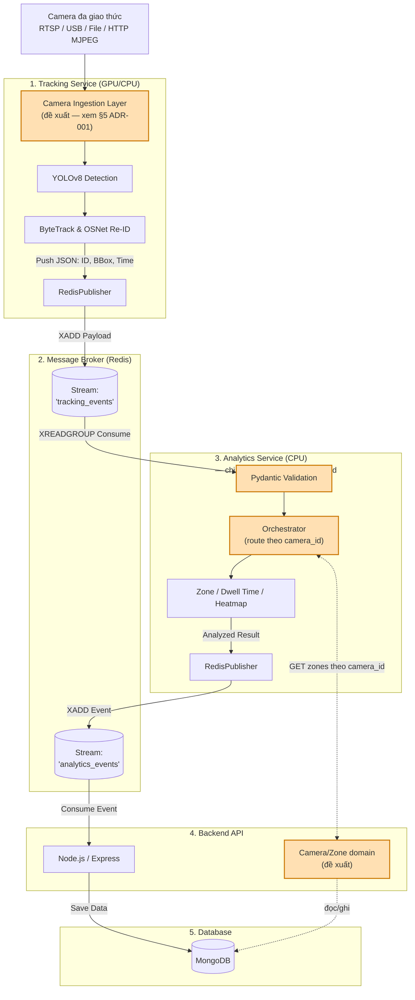
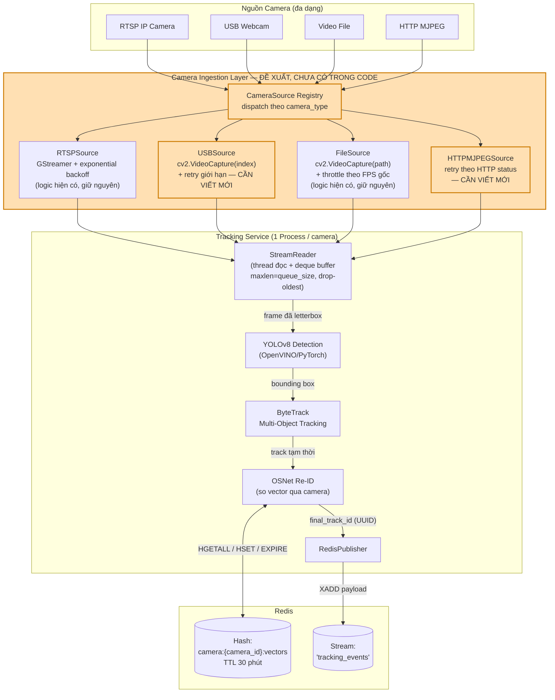
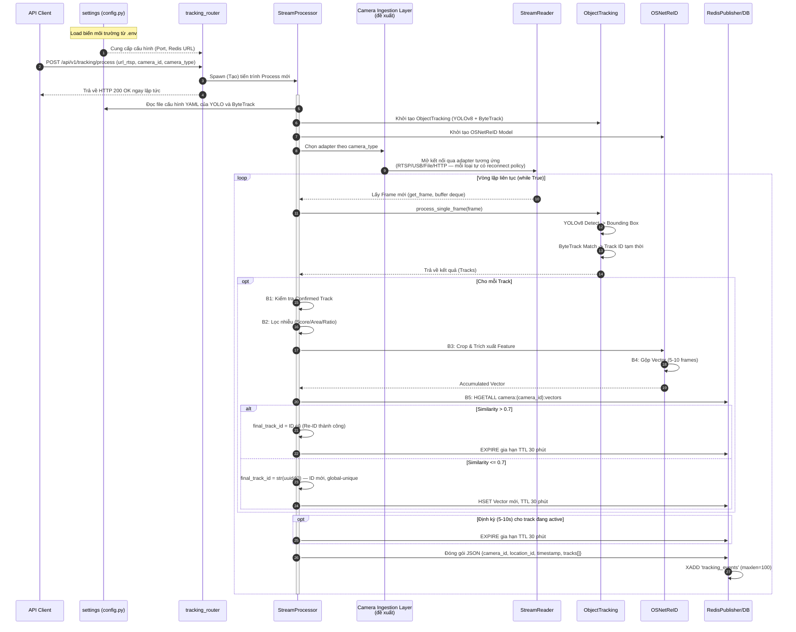

# Kiến Trúc & Luồng Xử Lý — Tracking Service

> Mô tả chi tiết `MODULE_AI/tracking_service` — service chịu trách nhiệm detect, track, và
> re-identify người từ camera, sau đó publish kết quả lên Redis Stream `tracking_events` cho
> `analytics_service` tiêu thụ. Xem thêm [`diagram_ai_analysis.md`](./diagram_ai_analysis.md)
> cho phần xử lý phía sau.

---

## 0. Sơ Đồ Kiến Trúc Tổng Thể Toàn Dự Án

Sơ đồ này thể hiện luồng dữ liệu đi từ Camera, qua các module AI, cho đến Backend và Database.
Mỗi service ở đây là 1 khối tổng quát — phần Tracking Service được khai triển chi tiết ở §1-4
bên dưới, phần Analytics Service xem [`diagram_ai_analysis.md`](./diagram_ai_analysis.md).



**Ô màu cam** = đề xuất kiến trúc, chưa tồn tại đầy đủ trong code hiện tại.

### Trạng thái triển khai toàn dự án (tổng quan nhanh)

| Thành phần | Trạng thái |
|---|---|
| Tracking Service — detect/track/Re-ID/publish Redis | ✅ Hoạt động |
| Tracking Service — Camera Ingestion Layer đa giao thức | ❌ Đề xuất, chưa build (chỉ có RTSP có reconnect) — xem §5 ADR-001 |
| Analytics Service — mọi hạng mục | Xem bảng trạng thái trong [`diagram_ai_analysis.md`](./diagram_ai_analysis.md#0-trạng-thái-triển-khai) |
| MODULE_BE — domain `camera`/`zone` (model + API) | ❌ Chưa build (chỉ scaffold `.gitkeep`) — cần cho cả 2 service |

---

## 1. Vai trò trong hệ thống

`tracking_service` chỉ có **một nhiệm vụ**: "thấy gì thì báo nấy" — vắt kiệt sức mạnh GPU/CPU
để bám sát đối tượng ở FPS cao nhất, publish tọa độ + track ID lên Redis, và **không** biết gì
về nghiệp vụ (zone, dwell time, heatmap) — những logic đó thuộc về `analytics_service`
(xem [`diagram_ai_analysis.md`](./diagram_ai_analysis.md)).

Mỗi camera được kích hoạt qua `POST /api/v1/tracking/process` chạy trong **1
`multiprocessing.Process` riêng biệt** (`app/api/v1/tracking_router.py`) — cách ly hoàn toàn ở
tầng OS, không chia sẻ state giữa các camera.

---

## 2. Sơ đồ kiến trúc tổng thể (đã cập nhật — bổ sung Camera Ingestion Layer)

> Sơ đồ gốc coi việc đọc camera là 1 khối `StreamReader` duy nhất. Thực tế code hiện tại
> (`app/processing/stream_reader.py`) chỉ phân biệt nhị phân **RTSP vs không-RTSP**: mọi
> nguồn không phải `rtsp://`/`rtsps://` (USB webcam, file, HTTP MJPEG...) đi chung 1 nhánh
> `cv2.VideoCapture` không có reconnect. Đây là điểm yếu khi mở rộng sang nhiều loại camera —
> khối **Camera Ingestion Layer** dưới đây là đề xuất bổ sung để giải quyết, chưa có trong code.



**Ô màu cam** = chưa tồn tại trong code, là đề xuất kiến trúc. Chi tiết lý do và thiết kế xem
[ADR-001](#adr-001-bổ-sung-camera-ingestion-layer) ở cuối tài liệu.

---

## 3. Sơ đồ Tuần tự (Sequence Diagram) — Pipeline xử lý 1 frame



---

## 4. Chú giải Pipeline OSNet Re-ID

| Bước | Tên Giai Đoạn | Mô tả Chi tiết |
| :--- | :--- | :--- |
| **B1** | Kiểm tra Confirmed Track | ByteTrack gán trạng thái mỗi bounding box. Chỉ track `Confirmed` (tồn tại ổn định qua nhiều frame) mới đi tiếp. |
| **B2** | Lọc Nhiễu (Noise Filtering) | Loại bbox kém chất lượng theo Score (YOLO confidence), Area (`w*h` đủ lớn), Ratio (`w/h` hợp lý). |
| **B3** | Crop & Trích xuất Feature | Cắt ảnh đối tượng, đưa qua OSNet lấy Feature Vector. Gồm Sharpness (độ nét) + Normalization (chuẩn hoá thành trọng số). |
| **B4** | Gộp Vector (Accumulation) | Gộp vector qua 5-10 frame: `Vector cuối = Tổng(Vector frame × Trọng số)`. |
| **B5** | So sánh & Lưu trữ (Redis) | So Cosine similarity với vector trong Redis (`HGETALL camera:{camera_id}:vectors`). `> 0.7` → ID cũ, gia hạn TTL 30 phút. `<= 0.7` → ID mới (`uuid4()`), `HSET` + TTL 30 phút. |
| **Refresh** | Gia hạn TTL định kỳ | Mỗi 5-10s, `EXPIRE` lại các track đang active để tránh Redis xoá nhầm người đứng lâu trước ống kính. |
| **Publish** | Đóng gói JSON & Gửi luồng | Gom `track_id`, bbox, `camera_id`, `location_id`, `timestamp` thành JSON, `XADD` vào `tracking_events`. |

**Lưu ý quan trọng cho `analytics_service`:** `final_track_id` là `str(uuid.uuid4())` —
global-unique theo thiết kế, không phải số đếm cục bộ. Do đó dù nhiều camera cùng publish vào
chung 1 stream `tracking_events`, track ID của các camera khác nhau **không bao giờ trùng
nhau** — xem thêm phân tích cách ly đa camera ở
[`diagram_ai_analysis.md` §5](./diagram_ai_analysis.md#5-cách-ly-dữ-liệu-đa-camera).

---

## ADR-001: Bổ sung Camera Ingestion Layer

### Status
Proposed

### Context
Code hiện tại (`app/processing/stream_reader.py:27`) chỉ phân loại nguồn camera theo 1 boolean
suy luận từ tiền tố URL:
```python
self._is_rtsp = source_uri.startswith("rtsp://") or source_uri.startswith("rtsps://")
```
Hệ quả:
- **RTSP**: có GStreamer pipeline tối ưu + reconnect exponential backoff (2s → 60s, vô hạn lần).
- **Mọi nguồn khác** (USB webcam, file, HTTP MJPEG): dùng chung 1 nhánh `cv2.VideoCapture`
  đơn giản, **không có reconnect** — bất kỳ lỗi đọc nào cũng bị coi là "EOF" và dừng hẳn
  process, phải gọi lại API thủ công.
- Không có field `camera_type` tường minh ở bất kỳ đâu (API request, config, DB) — việc suy
  luận từ prefix chuỗi khiến logic rẽ nhánh rải rác ở 3 file (`stream_reader.py`,
  `connection_utils.py`, `path_utils.py`), khó mở rộng thêm loại mới mà không sửa nhiều nơi.

Đây không phải rủi ro lý thuyết: nếu hệ thống dùng USB webcam hoặc HTTP MJPEG chạy 24/7 (thay
vì chỉ demo bằng file video ngắn), một sự cố mạng nhỏ sẽ làm dừng hẳn tracking của camera đó.

### Decision
Thêm 1 tầng trừu tượng hoá kết nối — **Camera Ingestion Layer** — đặt giữa cấu hình camera và
`StreamReader`, dưới dạng interface `CameraSource` với implementation riêng cho từng loại
(`RTSPSource`, `USBSource`, `FileSource`, `HTTPMJPEGSource`). Mỗi adapter tự định nghĩa cách mở
kết nối và **reconnect policy riêng** — không dùng chung 1 cơ chế backoff cho tất cả.

`StreamReader` giữ nguyên vai trò hiện tại (thread đọc + `deque` buffer decouple tốc độ đọc/xử
lý AI) — chỉ đổi chỗ gọi `cv2.VideoCapture(source_uri)` trực tiếp thành gọi qua adapter tương
ứng.

Đặt tầng này **nội bộ trong `tracking_service`** (thư mục `app/camera_sources/`), không tách
thành service riêng ở giai đoạn hiện tại.

### Alternatives Considered

**Tách thành "Camera Gateway" service độc lập** (chuẩn hoá mọi loại camera thành 1 format
thống nhất trước khi tới tracking_service)
- Ưu điểm: tách bạch trách nhiệm triệt để, dễ scale/monitor riêng theo số lượng camera.
- Nhược điểm: cần thêm hạ tầng truyền **frame** giữa 2 service — frame là dữ liệu nặng, không
  thể đi qua Redis Stream nhẹ nhàng như JSON tracking event; cần shared memory, RTSP restream
  nội bộ, hay gRPC streaming — chi phí lớn hơn đáng kể.
- Rejected (cho giai đoạn hiện tại): dự án đang ở giai đoạn `analytics_service` và `MODULE_BE`
  còn là skeleton, hiện chưa có camera nào ngoài file video demo (`VIDEO_SOURCE` default trong
  config). Đầu tư hạ tầng nặng cho vấn đề chưa xảy ra là tối ưu hoá sớm.

**Giữ nguyên hiện trạng, chỉ thêm reconnect cho non-RTSP mà không tạo interface**
- Ưu điểm: sửa nhanh, ít thay đổi.
- Rejected: không giải quyết gốc rễ — logic rẽ nhánh vẫn rải rác 3 file, thêm loại camera mới
  (vd ONVIF) vẫn phải sửa nhiều nơi thay vì thêm 1 class mới.

### Consequences
- Cần thêm field `camera_type` (enum: `rtsp`, `usb`, `file`, `http_mjpeg`, `onvif`...) vào
  `TrackingRequest` (Pydantic model, `tracking_router.py`) và model `Camera` ở `MODULE_BE`
  (domain hiện đang trống) — thay thế hoàn toàn suy luận `is_rtsp` từ prefix chuỗi.
- Cần viết mới reconnect policy cho USB/HTTP MJPEG (hiện là lỗ hổng thật, không phải rủi ro lý
  thuyết) — RTSP giữ nguyên logic exponential backoff hiện có.
- Nếu sau này cần scale tới mức phải tách thành service riêng, việc tách sẽ dễ hơn vì interface
  `CameraSource` đã tồn tại — chỉ cần đổi vị trí chạy, không cần viết lại logic kết nối.
