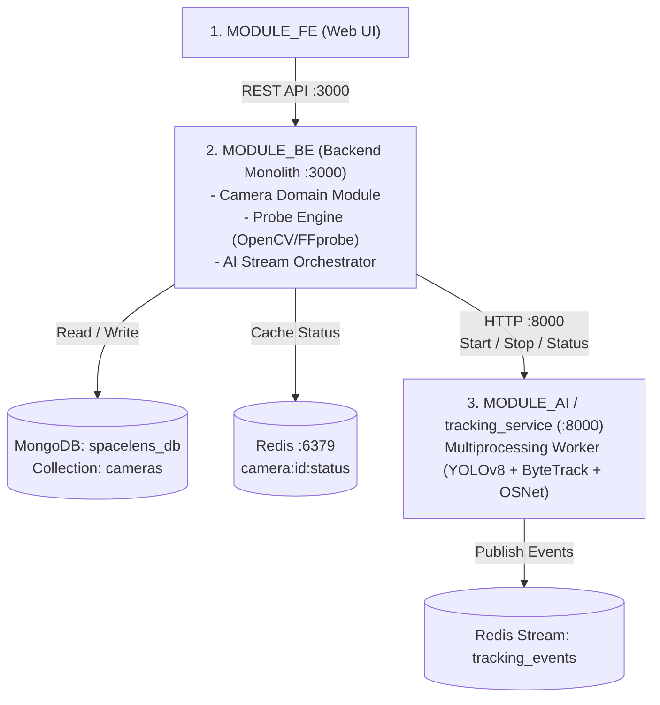
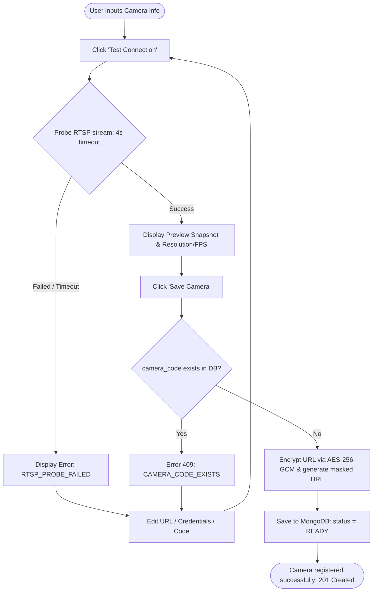
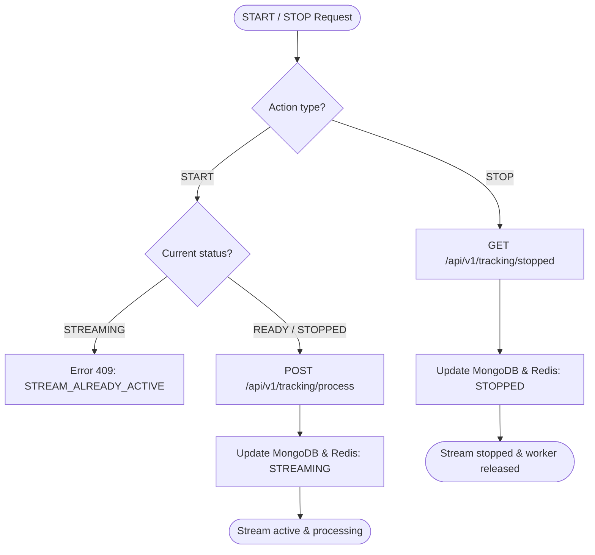
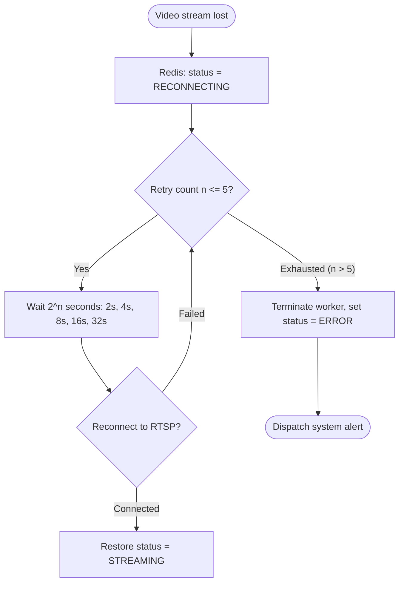
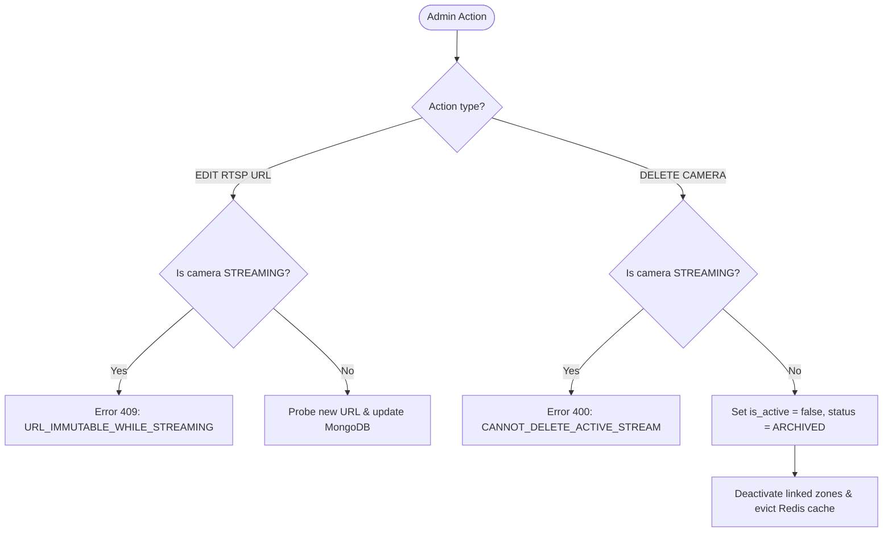

# Part 1: Mini Product Backlog & Business Flow (Camera Management)

> **Feature ID:** `FEAT-CAMERA-01` | **Version:** `2.3.0`  
> **Architecture:** Backend Monolith (`MODULE_BE :3000`) + AI Service (`MODULE_AI :8000`)  
> **Related Documents:**  
> - [Data Architecture (data.md)](./data.md)  
> - [Test Specification (test.md)](./test.md)

---

## 1. System Architecture

The system operates as a **Backend Monolith**: `MODULE_BE` acts as the single central server managing all business logic (Camera, Zone, Auth, Analytics), persisting data to MongoDB (`spacelens_db`), and communicating directly with `MODULE_AI` via HTTP REST and Redis.



---

## 2. Mini Product Backlog (7 Core Features)

| ID | Feature | User Story | Business Rules | Priority |
|:---:|---|---|---|:---:|
| **CAM-01** | **Camera Registration** | *As an Admin*, I want to register a camera with `camera_code`, name, location, floor, and RTSP URL so that the system identifies the video feed. | - `camera_code` must be globally unique.<br/>- RTSP credentials must be encrypted via **AES-256-GCM** at rest; API only returns `url_rtsp_masked`. | **P0** |
| **CAM-02** | **Stream Connectivity Probe** | *As an Operator*, I want to probe the RTSP stream before activating to verify accessibility and extract stream parameters. | - Probe timeout is capped at 4 seconds.<br/>- Automatically extract resolution (`width`, `height`), `fps`, and `codec`.<br/>- Capture 1 Base64 preview snapshot. | **P0** |
| **CAM-03** | **AI Stream Orchestration** | *As an Operator*, I want to `START` or `STOP` AI tracking on a camera feed to manage real-time processing. | - Can only start from `READY` or `STOPPED` state.<br/>- Each stream runs in an isolated OS process (`multiprocessing.Process`).<br/>- Stopping kills the worker process and marks status as `STOPPED`. | **P0** |
| **CAM-04** | **Camera Inventory & Filtering** | *As an Admin*, I want to search, paginate, and filter cameras by location and status to manage video sources efficiently. | - Filter by `location_id`, `status`, and source type.<br/>- Fuzzy search by camera name or code.<br/>- All responses must mask sensitive RTSP credentials. | **P1** |
| **CAM-05** | **Periodic Status Monitoring** | *As the System*, I want to periodically poll AI worker health to detect crashes or zombie processes. | - Background heartbeat runs every 15 seconds.<br/>- 3-way synchronization: AI Worker $\leftrightarrow$ Redis Cache $\leftrightarrow$ MongoDB.<br/>- Automatically triggers recovery if the AI process dies unexpectedly. | **P1** |
| **CAM-06** | **Auto-Reconnection & Failover** | *As the System*, I want to auto-reconnect when a camera stream drops to prevent permanent pipeline failure. | - On frame drop, mark status as `RECONNECTING`.<br/>- Retry with **Exponential Backoff: 2s, 4s, 8s, 16s, 32s** (max 5 retries).<br/>- If all 5 retries fail, transition to `ERROR` and fire an alert. | **P1** |
| **CAM-07** | **Configuration & Safeguards** | *As an Admin*, I want to update metadata and delete cameras safely without disrupting active streaming pipelines. | - **Modifying RTSP URL while `STREAMING` is blocked** (must STOP first).<br/>- **Deleting a camera while `STREAMING` is blocked**.<br/>- Soft delete (`is_active = false`, `status = ARCHIVED`) terminates the AI worker and marks associated zones `INACTIVE`. | **P1** |

---

## 3. End-to-End Business Flow

```mermaid
flowchart TD
    %% Step 1: Registration & Probe
    SubReg[1. Register & Probe] --> TestRTSP{Test RTSP connection (4s timeout)}
    TestRTSP -- Failed --> ErrProbe[Error 422: Cannot reach camera]
    TestRTSP -- Success --> SaveCam[Encrypt URL AES-256 & Save to MongoDB: status = READY]

    %% Step 2: Stream Operation
    SaveCam --> SubStream[2. Stream Operations]
    SubStream --> ActionStart{Start AI Stream?}
    ActionStart -- Yes --> CallAI[Call AI Service: POST /tracking/process]
    CallAI --> SetStreaming[Update status: STREAMING]
    
    %% Step 3: Monitoring & Auto-recovery
    SetStreaming --> Monitor{Stream disconnected?}
    Monitor -- No --> KeepRunning[Continue monitoring & Heartbeat every 15s]
    Monitor -- Yes --> RetryLoop{Exponential Backoff (Max 5 retries)}
    RetryLoop -- Reconnected --> SetStreaming
    RetryLoop -- All 5 failed --> SetError[Set status = ERROR & Dispatch alert]

    %% Step 4: Stop & Safeguard
    KeepRunning --> ActionStop{Stop stream?}
    ActionStop -- Yes --> StopAI[Call AI: GET /tracking/stopped]
    StopAI --> SetStopped[Update status: STOPPED]
    SetStopped --> Safeguard[RTSP modification and deletion allowed only when STOPPED]
```

---

## 4. Key Process Flowcharts

### 4.1 Camera Registration & Stream Probe (CAM-01, CAM-02)


### 4.2 Start / Stop AI Tracking (CAM-03)


### 4.3 Auto-Reconnection & Failover (CAM-06)


### 4.4 Lifecycle Safeguards & Safe Deletion (CAM-07)

