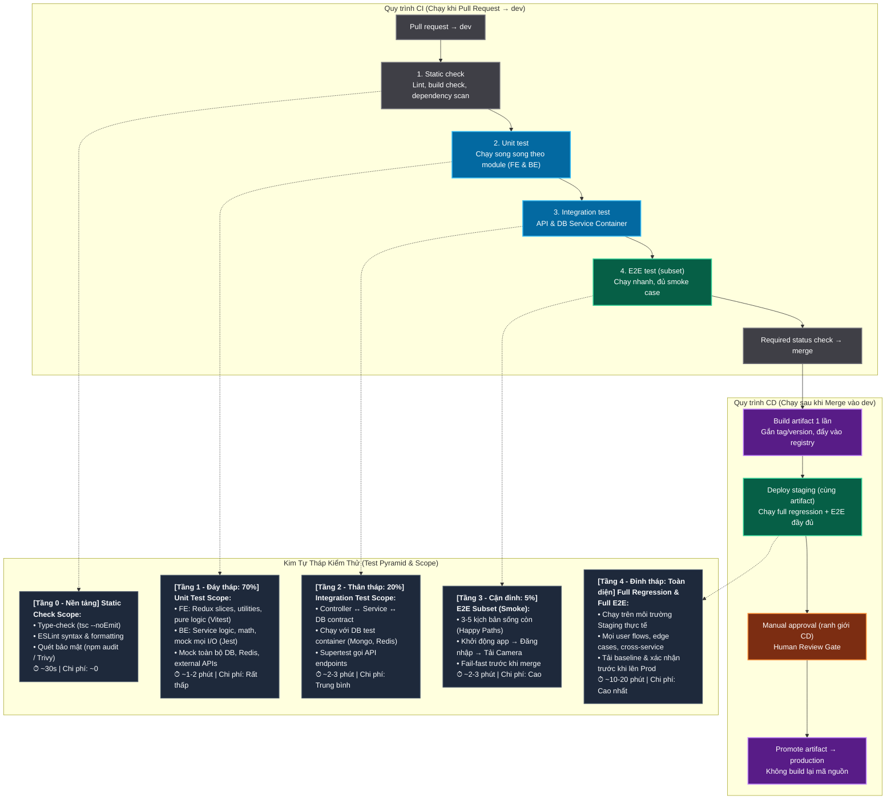

# Kiến Trúc CI/CD Pipeline & Mô Hình Kim Tự Tháp Kiểm Thử (Test Pyramid)

> 📁 File vẽ Draw.io tương ứng: [`.temps/pipeline-test.drawio`](file:///d:/Project_NCKH/spacelensproject/.temps/pipeline-test.drawio) (mở trực tiếp bằng extension *Draw.io Integration* trong VS Code).

---

## 1. Sơ Đồ Tổng Thể Pipeline & Test Scope Mapping

---

## 2. Bảng Phân Định Chi Tiết Test Scope Ở Từng Bước

| Bước trong Pipeline | Màu đại diện | Vị trí trong Tháp kiểm thử | Test Scope (Phạm vi kiểm thử) | Đặc điểm & Nguyên tắc |
| :--- | :--- | :--- | :--- | :--- |
| **1. Static check** | Xám | **Nền tảng mở rộng (Tầng 0)** | • **TypeScript:** Compile check không emit file (`tsc --noEmit`) nhằm phát hiện sai lệch kiểu dữ liệu. • **Linter:** ESLint kiểm tra quy chuẩn coding conventions, import thừa, biến không dùng. • **Security audit:** `npm audit` quét lỗ hổng bảo mật của dependencies cấp độ High/Critical. | **Fail-Fast**: Phát hiện lỗi cú pháp và lỗ hổng ngay trong 30 giây đầu tiên, chặn việc tiêu tốn tài nguyên server cho các bước test nặng phía sau. |
| **2. Unit test** | Xanh dương | **Đáy tháp (Tầng 1 - Chiếm 70%)** | • **Frontend Scope:** Kiểm thử Redux Toolkit slices (`cameraSlice.spec.ts`), action creators, helper functions, hooks thuần túy với Vitest. • **Backend Scope:** Kiểm thử từng class/method trong service (`camera.service.spec.ts`), business rules. • **Mocking:** Mock 100% database, redis, http requests. | **Chạy song song (Parallel):** Worker FE và Worker BE chạy đồng thời để tối ưu thời gian. Độ bao phủ lớn nhất nhưng chạy cực nhanh. |
| **3. Integration test** | Xanh dương | **Thân tháp (Tầng 2 - Chiếm 20%)** | • Kiểm thử liên kết giữa Controller ↔ Service ↔ Database / Cache. • Kiểm tra validation pipes (class-validator), DTO mapping, Mongoose schema constraints. • Sử dụng Service Containers (Redis, MongoDB In-Memory hoặc test container) trong runner. | Đảm bảo các mảnh ghép bên trong backend hoặc frontend khớp với nhau, bắt lỗi hợp đồng API mà unit test không thấy được. |
| **4. E2E test (subset)** | Xanh ngọc | **Cận đỉnh (Tầng 3 - Chiếm ~5%)** | • **Smoke Test Subset:** Chỉ kiểm tra các luồng nghiệp vụ cốt lõi sống còn (Happy Paths). • Ví dụ: Render trang đăng nhập → Đăng nhập thành công → Gọi API lấy danh sách Camera hiển thị lên Grid. • Bỏ qua các kịch bản ngoại lệ hoặc edge cases phức tạp. | **Pre-merge Gate:** Giữ thời gian chạy PR dưới 3 phút nhưng vẫn đảm bảo bản build không bị "vỡ vụn" (broken build) khi đưa vào `dev`. |
| **Required status check → merge** | Xám | **Cổng kiểm soát chất lượng** | • Tổng hợp kết quả từ Step 1 đến Step 4. • Điều kiện tiên quyết: Cả 4 bước phải xanh lá (`success`) thì PR mới đủ điều kiện bấm Merge vào `dev`. | Bảo vệ nhánh `dev` luôn ở trạng thái buildable và runnable. |
| **Build artifact 1 lần** | Tím | **Đóng gói & Định danh** | • Build Docker image duy nhất cho từng service. • Gắn tag phiên bản (Git SHA rút gọn, ví dụ `:dev-a1b2c3d`) và đẩy lên Container Registry (Docker Hub / GHCR). | **Build Once, Deploy Anywhere:** Đảm bảo artifact chạy trên Staging và Production là hoàn toàn đồng nhất 100%. |
| **Deploy staging (cùng artifact)** | Xanh ngọc | **Đỉnh tháp (Tầng 4 - Toàn diện)** | • Triển khai đúng Docker image vừa build lên server Staging. • **Full Regression Test Suite:** Chạy toàn bộ các test case hồi quy. • **Full E2E Test Suite:** Kiểm thử toàn diện mọi luồng nghiệp vụ, tương tác chéo giữa FE + BE + AI Services (Zone, Dwell time, Heatmap), edge cases, tải cơ bản. | Kiểm chứng độ tin cậy thực tế trên môi trường giống thật nhất trước khi đưa ra người dùng cuối. |
| **Manual approval** | Cam / Nâu | **Ranh giới CD (Human Gate)** | • Dừng pipeline chờ Tech Lead hoặc Release Manager xem xét báo cáo test Staging. • Phê duyệt thủ công trên GitHub Environment (`production`). | Ranh giới an toàn ngăn chặn việc tự động deploy thẳng lên Production khi chưa có sự xác nhận của con người. |
| **Promote artifact → production** | Tím | **Triển khai Production** | • Lấy chính xác Docker image đã được verify trên Staging chuyển sang Production. • **Tuyệt đối KHÔNG build lại mã nguồn** từ Git. | Giảm thiểu tối đa rủi ro cấu hình và đảm bảo tính nhất quán (Immutability). |

---

## 3. Cách Sử Dụng File Sơ Đồ `.drawio`

File [`docs/pipeline_test_pyramid.drawio`](./pipeline_test_pyramid.drawio) đã được thiết kế sẵn với:
1. **Giao diện chuẩn dark theme cao cấp** (`#0F172A`).
2. **Cột trái:** Pipeline Flow 10 bước bám sát 100% sơ đồ và màu sắc bạn đã cung cấp.
3. **Cột phải:** Mô hình Kim tự tháp kiểm thử với đầy đủ chi tiết Test Scope, tỷ trọng, thời gian và công cụ cho từng tầng.
4. **Đường gióng kết nối:** Mũi tên nét đứt (`dashed connectors`) liên kết trực quan từng step trong pipeline sang đúng tầng kiểm thử tương ứng.

### Các cách mở file:
* **Cách 1 (Ngay trong VS Code / IDE):** Cài extension **Draw.io Integration** (tác giả *Henning Dieterichs*) -> Nhấp đúp vào file [`docs/pipeline_test_pyramid.drawio`](./pipeline_test_pyramid.drawio) để xem và chỉnh sửa đồ hoạ trực tiếp.
* **Cách 2 (Trình duyệt web):** Truy cập [app.diagrams.net](https://app.diagrams.net) -> Chọn **Open Existing Diagram** -> Chọn file `pipeline_test_pyramid.drawio` trong thư mục `docs/`.
