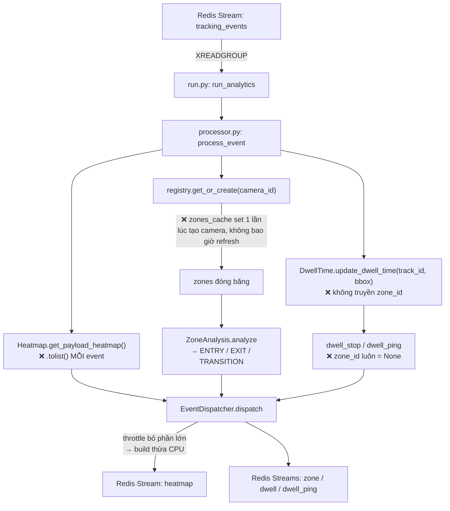
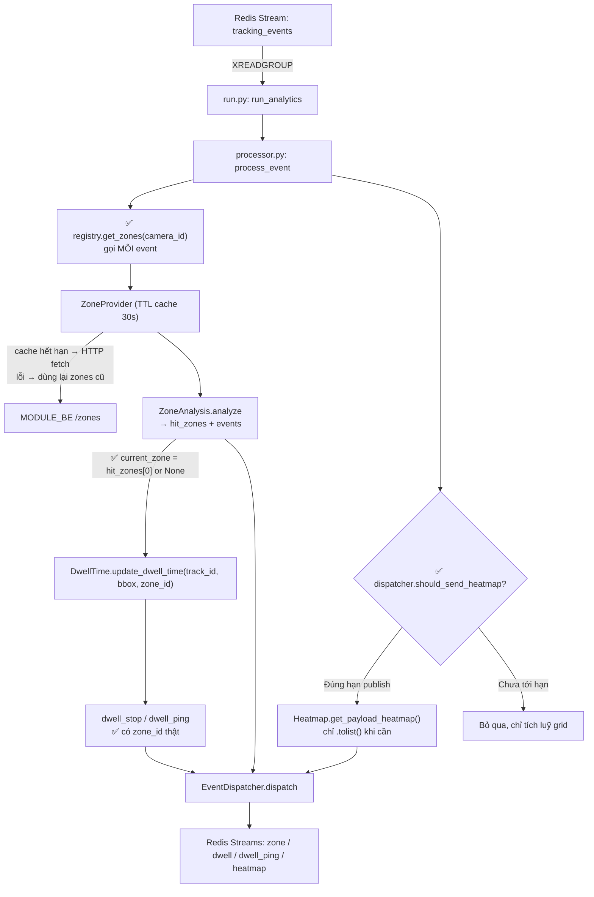

# Fix các lỗi logic trong analytics_service (zone cache, dwell zone_id, heatmap CPU, dọn rác)

## Context

Sau khi rà soát toàn bộ `analytics_service`, code compile sạch và import OK, nhưng có 2 lỗi
logic làm sai/vô hiệu hoá tính năng, cộng vài điểm lãng phí + rác cần dọn. Đặc biệt lỗi
`zones_cache` đóng băng khiến cơ chế TTL cache của `ZoneProvider` (vừa build ở bước trước)
không bao giờ chạy lại — coi như feature zone-từ-BE chết. Mục tiêu: sửa cho 4 nhóm lỗi đã
chốt, không thêm tính năng mới, giữ interface public ổn định.

## Sơ đồ luồng xử lý

### Luồng hiện tại (có lỗi)



### Luồng sau khi fix



## Thiết kế

### 1. 🔴 `zones_cache` đóng băng → gọi zone theo TTL mỗi event

Vấn đề: `analyzer_registry.py:37` set `"zones_cache"` **1 lần** lúc tạo camera;
`processor.py:9` đọc lại giá trị đóng băng đó mỗi event → `ZoneProvider.get_zones()`
(đã tự throttle bằng TTL) không bao giờ được gọi lại.

Sửa:
- `analyzer_registry.py`: **bỏ** key `"zones_cache"` khỏi dict per-camera. Thêm 1 method public
  `get_zones(self, camera_id: str) -> list[dict]` chỉ delegate `return self._zone_provider.get_zones(camera_id)`.
- `processor.py`: đổi `zones = analyzers["zones_cache"]` → `zones = registry.get_zones(event.camera_id)`
  (gọi mỗi event; TTL trong `ZoneProvider` lo việc không spam HTTP).
- Cập nhật README `analytics_service/README.md` dòng mô tả dict `{zone, dwell, heatmap, zones_cache, ...}`
  (dòng ~94) bỏ `zones_cache`.

### 2. 🟠 Dwell event luôn thiếu `zone_id` → truyền zone hiện tại của track vào dwell

Vấn đề: `dwelltime_analysis.py:41` đọc `obj_dwell_time.get("current_zone")` nhưng
`update_dwell_time()` không bao giờ set key này; `processor.py:29` gọi
`alert_stopped_objects(track.id)` không truyền zone → mọi `dwell_stop`/`dwell_ping` có `zone_id=None`.

Sửa (nguồn zone lấy từ kết quả zone analysis cùng vòng lặp — `_hit_zones` trả về từ
`ZoneAnalysis.analyze()`, phần tử đầu là zone đang đứng, rỗng = ngoài zone → `None`):
- `dwelltime_analysis.py`:
  - `update_dwell_time(self, track_id, current_pos, zone_id=None)` — lưu `"current_zone": zone_id`
    vào record cả lúc tạo mới lẫn lúc cập nhật (để `finalize_stop_event` đọc được zone mới nhất).
  - `alert_stopped_objects` giữ nguyên signature `(track_id, zone_id=None)` — đã có sẵn, chỉ cần
    processor truyền vào.
- `processor.py`: trong vòng lặp track, tính `current_zone = _hit_zones[0] if _hit_zones else None`;
  truyền vào `update_dwell_time(track.id, track.bbox, zone_id=current_zone)`; và ở vòng ping,
  gọi `alert_stopped_objects(track.id, zone_id=...)`. Vì vòng ping tách khỏi vòng zone, sẽ gom
  `track_id -> current_zone` vào 1 dict nhỏ ở vòng đầu rồi tra lại ở vòng ping (không gọi lại zone analysis).

### 3. 🟡 Heatmap phí CPU → chỉ build payload khi tới hạn publish

#### Phân tích chi tiết

Luồng hiện tại bị sai **thứ tự** — "build trước, hỏi sau":

```
Mỗi event tracking (vd 25 event/giây):
  processor.py:34-36
    └─> get_payload_heatmap()          ← BUILD: matrix.tolist() — TỐN CPU
    └─> build_heatmap_event(...)       ← BUILD: tạo Pydantic payload
    └─> dispatcher.dispatch(e)
          └─> _dispatch_heatmap()      ← HỎI: "tới hạn gửi chưa?"
                ├─ chưa tới hạn → return (VỨT payload vừa build)   ← 124/125 lần
                └─ tới hạn      → publish                          ← 1/125 lần
```

Hai chỗ tốn công vô ích tại `processor.py:34-36`:
1. **`get_payload_heatmap()`** — chạy `heatmap_matrix.tolist()`: duyệt toàn bộ ma trận numpy,
   cấp phát list-of-lists mới (grid 48×27 ≈ 1.300 phần tử) **mỗi frame**.
2. **`build_heatmap_event()`** — tạo `HeatmapEventPayload` (Pydantic validate cả grid).

Rồi 99% payload bị `event_dispatcher.py:42-43` vứt vì chưa đủ `heatmap_interval_sec`.
Ví dụ camera 25 FPS, interval 5s → 124/125 lần build là vô ích. **Dữ liệu gửi lên Redis
vẫn đúng** — chỉ đốt CPU thừa ở giữa.

#### So sánh hướng sửa

| Hướng | Cách làm | Đánh giá |
|---|---|---|
| A. Processor tự giữ timer riêng | Thêm `last_sent` dict vào processor | ❌ Trạng thái throttle tách 2 nơi → dễ lệch |
| B. Dispatcher nhận lazy callback | `dispatch(lambda: build_payload())` | ❌ Phá interface `dispatch(payload)` thống nhất |
| **C. Dispatcher expose `should_send_heatmap()`** | Processor hỏi trước, chỉ build khi True | ✅ Timer vẫn 1 nơi giữ, interface không đổi |

Chọn **C** — "hỏi trước, build sau": dispatcher vẫn là chủ sở hữu duy nhất của trạng thái
throttle (`_last_sent`), processor chỉ hỏi ý kiến trước khi làm việc nặng.

#### Cách sửa cụ thể

**Bước 1 — `event_dispatcher.py`**: tách phần kiểm tra hạn thành method public:

```python
def should_send_heatmap(self, camera_id: str) -> bool:
    key = ("heatmap_update", camera_id)
    now = time.monotonic()
    if now - self._last_sent.get(key, 0.0) < self._heatmap_interval_sec:
        return False
    self._last_sent[key] = now
    return True

def _dispatch_heatmap(self, event: HeatmapEventPayload) -> None:
    # Gate đã nằm ở should_send_heatmap() phía processor → chỉ việc publish
    self._producer.publish(self._heatmap_stream, event.model_dump())
```

2 điểm tinh tế:
- **Key**: code cũ dùng `(event.event_type, event.camera_id)`, nhưng lúc gọi `should_send_heatmap`
  chưa có event → hardcode `"heatmap_update"` (heatmap chỉ có 1 event_type duy nhất, do
  `build_heatmap_event` tạo).
- **Ghi `_last_sent` ngay trong `should_send_heatmap`** (không đợi lúc publish) — nếu ghi ở
  publish thì phải kiểm tra 2 lần, lần 2 có thể fail do thời gian trôi giữa 2 lần gọi.

**Bước 2 — `processor.py`**: chỉ build khi được phép:

```python
# TRƯỚC — build mỗi event, dispatcher vứt phần lớn
out_events.append(build_heatmap_event(
    event.camera_id, event.timestamp, analyzers["heatmap"].get_payload_heatmap(),
))

# SAU — hỏi trước, chỉ build khi tới hạn publish
if dispatcher.should_send_heatmap(event.camera_id):
    out_events.append(build_heatmap_event(
        event.camera_id, event.timestamp, analyzers["heatmap"].get_payload_heatmap(),
    ))
```

**Giữ nguyên (quan trọng)**:
- `update_grid_cell()` (`processor.py:23`) **vẫn chạy mỗi event** — bước tích luỹ điểm nóng +
  decay, rẻ và bắt buộc chạy liên tục, nếu không heatmap mất dữ liệu giữa 2 lần publish.
- Interface `dispatch(event)` không đổi — zone/dwell không ảnh hưởng.
- Tần suất gửi Redis không đổi — vẫn đúng `HEATMAP_PUBLISH_INTERVAL_SEC`.

Kết quả sau sửa:

```
Mỗi event:  update_grid_cell()               ← rẻ, vẫn chạy (tích luỹ)
            should_send_heatmap()?           ← 1 phép so sánh float, gần như free
              ├─ False (124/125 lần) → không làm gì thêm
              └─ True  (1/125 lần)   → tolist() + build + publish
```

CPU cho `.tolist()` giảm ~99%, hành vi bên ngoài giữ nguyên 100%.

### 4. 🟡 Dọn rác

- `redis_producer.py`: bỏ dòng `print("payload : ", payload)` (L13).
- `dwelltime_analysis.py`: xoá `flush_all_active()` (L109-113) — dead code, grep xác nhận không nơi nào gọi.
- `config.py`: sửa `MODULE_NAME = "Tracking Service"` → `"Analytics Service"` (khớp README); xoá các
  setting rác chỉ dùng ở tracking_service: `APP`, `YOLOV8_CONFIG_PATH`, `BYTETRACK_CONFIG_PATH`,
  `VIDEO_SOURCE`, và method `read_yaml_config()` + import `yaml`/`lru_cache` không còn dùng
  (grep xác nhận chỉ xuất hiện trong chính config.py).

## Files bị ảnh hưởng
- `app/processor.py` — gọi zone theo TTL mỗi event; truyền zone vào dwell; gate heatmap
- `app/core/analyzer_registry.py` — bỏ `zones_cache`, thêm `get_zones()`
- `app/core/dwelltime_analysis.py` — `update_dwell_time(..., zone_id)` set `current_zone`; xoá `flush_all_active`
- `app/communication/event_dispatcher.py` — thêm `should_send_heatmap()`, bỏ throttle trong nhánh dispatch
- `app/communication/redis_producer.py` — bỏ print debug
- `app/config.py` — fix MODULE_NAME, xoá setting/method rác
- `README.md` (analytics_service) — bỏ `zones_cache` trong mô tả dict registry

Không đổi: `zone_analysis.py`, `heatmap_analysis.py` (logic tích luỹ giữ nguyên), `zone_provider.py`,
`zone_client.py`, schemas, `run.py`, `redis_consumer.py`.

## Verification
- `python -m compileall -q app main.py` và import thử toàn bộ module → không lỗi.
- Chạy `python main.py` (BE zone chưa có) → không crash, log `"Failed to refresh zones..."`, service vẫn tiêu thụ event bình thường.
- Test TTL thực sự hoạt động: mock `fetch_zones`, gọi `process_event` nhiều lần cách nhau > `ZONE_CACHE_TTL_SEC` → xác nhận `fetch_zones` được gọi lại (không còn đóng băng).
- Test dwell zone_id: dựng event giả cho 1 track đứng yên trong 1 zone đủ lâu rồi rời đi → xác nhận `dwell_stop` có `zone_id` đúng tên zone (không còn `None`); track đứng > ping_threshold → `dwell_ping` có `zone_id`.
- Test heatmap gate: spy `get_payload_heatmap`, đẩy nhiều event liên tiếp trong < `HEATMAP_PUBLISH_INTERVAL_SEC` → xác nhận `get_payload_heatmap` chỉ được gọi 1 lần (thay vì mỗi event).
