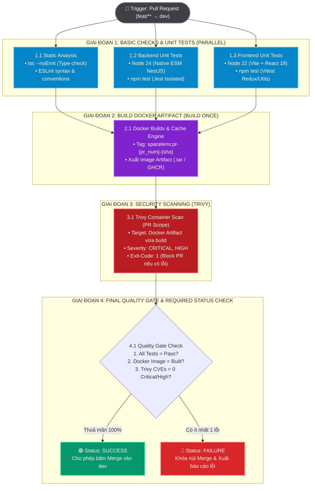

# Đặc Tả Kiến Trúc Pipeline Step 1: Pull Request (feat/** → dev)

> **Mục tiêu tài liệu:** Định nghĩa toàn bộ quy chuẩn kỹ thuật và luồng thực thi tự động khi một lập trình viên tạo hoặc cập nhật Pull Request từ nhánh tính năng (`feat/**`, `fix/**`) vào nhánh tích hợp (`dev`).
>
> 📁 **Sơ đồ Draw.io trực quan tương ứng:** [`.temps/pipeline-test.drawio`](../.temps/pipeline-test.drawio) (Tab: *Step 1 - PR to Dev Detailed Flow*).

---

## 1. Tổng Quan Kiến Trúc (Architecture Overview)

Quy trình Step 1 được xây dựng theo 4 nguyên tắc cốt lõi:
1. **Fail-Fast & Parallel Execution:** Tách biệt các bài kiểm tra tĩnh (Type-check, Lint) và Unit tests chạy song song giữa Frontend & Backend để phản hồi kết quả trong vòng 1-2 phút đầu tiên.
2. **Build Once, Reuse Everywhere (Tính Bất Biến của Artifact):** Docker Image được đóng gói duy nhất **một lần** trên mỗi commit của PR, gắn tag định danh theo Git Commit SHA, và được tái sử dụng xuyên suốt toàn bộ các bước kiểm tra tiếp theo mà không bao giờ build lại từ mã nguồn.
3. **Phân Tầng Bảo Mật (Tiered Trivy Security Scan):** 
   - Trên PR vào `dev`: Quét tập trung vào các lỗ hổng cấp độ nghiêm trọng (`CRITICAL` & `HIGH`), chặn đứng nguy cơ bảo mật trước khi vào nhánh chính.
   - Khi Promote (sang `staging` và `main`): Mở rộng toàn diện **Full Trivy Scan** (bao gồm `LOW`, `MEDIUM`, `HIGH`, `CRITICAL`, misconfiguration, và rò rỉ secret).
4. **Unified Quality Gate:** Điểm chốt chặn duy nhất xác thực mọi tiêu chí (Tests, Artifact Build, Vulnerability Free) trước khi bật trạng thái xanh cho phép merge vào `dev`.

---

## 2. Sơ Đồ Luồng Hoạt Động (Mermaid Flowchart)



---

## 3. Đặc Tả Chi Tiết 4 Giai Đoạn Thực Thi

### Giai Đoạn 1: Basic Checks & Parallel Tests (Kiểm thử cơ sở)
* **Mục đích:** Đảm bảo tính toàn vẹn cú pháp, kiểu dữ liệu TypeScript và logic nghiệp vụ cơ sở trước khi tiêu tốn tài nguyên build Docker.
* **Cơ chế thực thi:** 3 workers chạy song song (Parallel execution):
  1. **Static Check Worker:**
     - Chạy `tsc --noEmit` trên cả Frontend và Backend để bắt lỗi type-mismatch, thiếu properties interface.
     - Chạy `eslint .` nhằm đảm bảo chuẩn hoá code conventions, không còn dead code hoặc unused imports.
  2. **Backend Unit Test Worker:**
     - Môi trường: Node.js 24 (tương thích Native ESM NestJS 12).
     - Lệnh chạy: `npm test` trong thư mục `MODULE_BE`.
     - Quy tắc: Mock 100% Database, Redis và Network. Thời gian chạy mục tiêu: `< 45 giây`.
  3. **Frontend Unit Test Worker:**
     - Môi trường: Node.js 22 (tương thích Vite & React 18).
     - Lệnh chạy: `npm test` trong thư mục `MODULE_FE` (Vitest).
     - Quy tắc: Kiểm thử các Redux toolkit slices (`cameraSlice`), pure logic utility functions. Thời gian chạy: `< 30 giây`.

---

### Giai Đoạn 2: Build Docker Image Artifact (Nguyên tắc Build Once)
* **Mục đích:** Sinh ra một Docker Image duy nhất ứng với commit SHA của PR để làm đối tượng kiểm tra an ninh (Trivy) và tái sử dụng cho các giai đoạn sau.
* **Điều kiện tiên quyết:** `needs: [static-check, be-unit-tests, fe-unit-tests]`.
* **Quy chuẩn Tag định danh:**
  $$\text{Image Tag} = \text{spacelens-be}:\text{pr-}\{\text{pr\_number}\}-\{\text{short\_sha}\}$$
  *(Ví dụ: `spacelens-be:pr-42-a1b2c3d`)*
* **Tối ưu hóa Build:**
  - Sử dụng **Docker Buildx** kết hợp GitHub Actions Cache (`type=gha,mode=max`) để tái sử dụng các layer không thay đổi giữa các lần push commit mới vào PR.
  - Sau khi build xong, image được nén hoặc lưu trữ tạm thời thành Pipeline Artifact bằng `actions/upload-artifact` để các job sau nạp lại mà không bao giờ build lại từ source.

---

### Giai Đoạn 3: Quét Lỗ Hổng Bảo Mật (Trivy Container Scan)
* **Mục đích:** Ngăn ngừa các thư viện hệ điều hành (OS packages) hoặc npm dependencies trong container image chứa các mã độc hoặc lỗ hổng đã được cảnh báo (CVE).
* **Điều kiện tiên quyết:** `needs: [build-docker-artifact]`.
* **Chiến lược phân tầng quét giữa PR và Promotion:**

| Tiêu chí | Giai đoạn PR (`feat/** → dev`) *(Step 1 Hiện Tại)* | Giai đoạn Promotion (`dev → staging / main`) |
| :--- | :--- | :--- |
| **Đối tượng quét** | Docker Image Artifact vừa build ở Step 2 | Docker Image Artifact chính thức trên Registry |
| **Mức độ Severity** | `CRITICAL`, `HIGH` | **FULL SCAN:** `LOW`, `MEDIUM`, `HIGH`, `CRITICAL` |
| **Exit Code** | `exit-code: 1` (Chặn PR lập tức nếu vi phạm) | `exit-code: 1` đối với Critical/High; Cảnh báo đối với Medium/Low |
| **Phạm vi kiểm tra** | OS Packages & Application Dependencies CVEs | CVEs + Container Misconfigurations + Secret Leaks |
| **Báo cáo đầu ra** | Bảng tóm tắt in trực tiếp vào `GITHUB_STEP_SUMMARY` | File chuẩn SARIF được đẩy lên tab **GitHub Security / Code Scanning** |
| **Lý do thiết kế** | **Fail-Fast:** Tránh làm nghẽn tiến độ của lập trình viên vì các cảnh báo nhỏ chưa có bản vá, tập trung xử lý lỗ hổng nghiêm trọng. | **Compliance:** Đảm bảo hệ thống đạt chuẩn an toàn tuyệt đối trước khi ra Production. |

---

### Giai Đoạn 4: Quality Gate & Status Check Evaluation
* **Mục đích:** Đóng vai trò là "Cổng chất lượng duy nhất" kiểm soát tính hợp lệ của PR.
* **Điều kiện thực thi:** `if: always()`, lắng nghe kết quả từ tất cả các giai đoạn trước.
* **Bảng Tiêu Chí Đánh Giá (Pass/Fail Matrix):**

| Điều kiện kiểm tra | Trạng thái yêu cầu | Hành vi khi vi phạm |
| :--- | :---: | :--- |
| **Static Check (Lint & Types)** | `SUCCESS` | Khóa PR — Yêu cầu lập trình viên sửa lỗi cú pháp / type error. |
| **Backend & Frontend Tests** | `SUCCESS` | Khóa PR — Báo cáo file test bị fail ra Step Summary. |
| **Docker Artifact Build** | `SUCCESS` | Khóa PR — Lỗi đóng gói hoặc thiếu tệp trong Dockerfile. |
| **Trivy Vulnerability Scan** | `SUCCESS` (0 High / 0 Critical CVEs) | Khóa PR — Yêu cầu nâng cấp version dependency bị lỗi bảo mật. |

* **Hành vi cuối cùng:**
  - Nếu **toàn bộ 4 tiêu chí đạt:** Trả về `exit 0`, gắn thẻ xanh `Success` cho GitHub Required Status Check. Nút **"Merge pull request"** được mở.
  - Nếu **bất kỳ tiêu chí nào thất bại:** Trả về `exit 1`, gắn thẻ đỏ `Failure`, khóa hoàn toàn khả năng merge để bảo vệ nhánh `dev`.

---

## 4. Mẫu Cấu Hình Tham Chiếu Cho `.github/workflows/main.yml`

```yaml
name: "Step 1: PR to Dev Pipeline"

on:
  pull_request:
    branches:
      - "dev"
    paths:
      - "MODULE_BE/**"
      - "MODULE_FE/**"
      - ".github/workflows/**"

concurrency:
  group: pr-${{ github.event.number }}
  cancel-in-progress: true

jobs:
  # ==========================================================
  # GIAI ĐOẠN 1: BASIC CHECKS & TESTS (CHẠY SONG SONG)
  # ==========================================================
  static-check:
    name: "1.1 Static Analysis (Types & Lint)"
    runs-on: ubuntu-latest
    steps:
      - uses: actions/checkout@v4
      - uses: actions/setup-node@v4
        with:
          node-version: "22"
      - name: Backend Type Check
        run: |
          cd MODULE_BE
          npm ci
          npx tsc --noEmit
      - name: Frontend Type Check & Lint
        run: |
          cd MODULE_FE
          npm ci
          npx tsc --noEmit

  be-unit-test:
    name: "1.2 Backend Unit Tests"
    runs-on: ubuntu-latest
    steps:
      - uses: actions/checkout@v4
      - uses: actions/setup-node@v4
        with:
          node-version: "24"
          cache: "npm"
          cache-dependency-path: "MODULE_BE/package-lock.json"
      - name: Run Backend Jest Tests
        run: |
          cd MODULE_BE
          npm ci
          npm test

  fe-unit-test:
    name: "1.3 Frontend Unit Tests"
    runs-on: ubuntu-latest
    steps:
      - uses: actions/checkout@v4
      - uses: actions/setup-node@v4
        with:
          node-version: "22"
          cache: "npm"
          cache-dependency-path: "MODULE_FE/package-lock.json"
      - name: Run Frontend Vitest Tests
        run: |
          cd MODULE_FE
          npm ci
          npm test

  # ==========================================================
  # GIAI ĐOẠN 2: BUILD DOCKER ARTIFACT (BUILD ONCE)
  # ==========================================================
  build-artifact:
    name: "2. Build Docker Image Artifact"
    needs: [static-check, be-unit-test, fe-unit-test]
    runs-on: ubuntu-latest
    steps:
      - uses: actions/checkout@v4
      - name: Set up Docker Buildx
        uses: docker/setup-buildx-action@v3
      - name: Build and Export Image
        uses: docker/build-push-action@v6
        with:
          context: ./MODULE_BE
          file: ./MODULE_BE/Dockerfile
          tags: spacelens-be:pr-${{ github.event.number }}-${{ github.sha }}
          outputs: type=docker,dest=/tmp/spacelens-be.tar
          cache-from: type=gha
          cache-to: type=gha,mode=max
      - name: Upload Docker Image Artifact
        uses: actions/upload-artifact@v4
        with:
          name: docker-artifact-be
          path: /tmp/spacelens-be.tar
          retention-days: 1

  # ==========================================================
  # GIAI ĐOẠN 3: SECURITY SCAN (TRIVY SCAN)
  # ==========================================================
  trivy-scan:
    name: "3. Trivy Vulnerability Scan (CRITICAL, HIGH)"
    needs: [build-artifact]
    runs-on: ubuntu-latest
    steps:
      - uses: actions/checkout@v4
      - name: Download Docker Artifact
        uses: actions/download-artifact@v4
        with:
          name: docker-artifact-be
          path: /tmp
      - name: Load Docker Image
        run: docker load -i /tmp/spacelens-be.tar
      - name: Run Trivy Scanner (PR Scope)
        uses: aquasecurity/trivy-action@master
        with:
          image-ref: "spacelens-be:pr-${{ github.event.number }}-${{ github.sha }}"
          format: "table"
          exit-code: "1"
          severity: "CRITICAL,HIGH"
          ignore-unfixed: true

  # ==========================================================
  # GIAI ĐOẠN 4: FINAL QUALITY GATE
  # ==========================================================
  quality-gate:
    name: "4. Quality Gate Evaluation"
    needs: [static-check, be-unit-test, fe-unit-test, build-artifact, trivy-scan]
    if: always()
    runs-on: ubuntu-latest
    steps:
      - name: Evaluate All Stage Results
        run: |
          echo "### 🛡️ SpaceLens Step 1: Quality Gate Evaluation Summary" >> $GITHUB_STEP_SUMMARY
          echo "| Validation Layer | Status |" >> $GITHUB_STEP_SUMMARY
          echo "| :--- | :---: |" >> $GITHUB_STEP_SUMMARY
          echo "| **Static Analysis (Types & Lint)** | ${{ needs.static-check.result == 'success' && '🟢 PASS' || '🔴 FAIL' }} |" >> $GITHUB_STEP_SUMMARY
          echo "| **Backend Unit Tests** | ${{ needs.be-unit-test.result == 'success' && '🟢 PASS' || '🔴 FAIL' }} |" >> $GITHUB_STEP_SUMMARY
          echo "| **Frontend Unit Tests** | ${{ needs.fe-unit-test.result == 'success' && '🟢 PASS' || '🔴 FAIL' }} |" >> $GITHUB_STEP_SUMMARY
          echo "| **Docker Artifact Build** | ${{ needs.build-artifact.result == 'success' && '🟢 PASS' || '🔴 FAIL' }} |" >> $GITHUB_STEP_SUMMARY
          echo "| **Trivy Vulnerability Scan (High/Critical)** | ${{ needs.trivy-scan.result == 'success' && '🟢 PASS' || '🔴 FAIL' }} |" >> $GITHUB_STEP_SUMMARY

          if [ "${{ needs.static-check.result }}" != "success" ] || \
             [ "${{ needs.be-unit-test.result }}" != "success" ] || \
             [ "${{ needs.fe-unit-test.result }}" != "success" ] || \
             [ "${{ needs.build-artifact.result }}" != "success" ] || \
             [ "${{ needs.trivy-scan.result }}" != "success" ]; then
            echo "::error::Quality Gate thất bại! PR chưa đáp ứng đủ tiêu chuẩn để merge vào dev."
            exit 1
          fi
          echo "::notice::Quality Gate đạt 100%! Đủ điều kiện merge vào dev."
```

---

## 5. Danh Mục Chuẩn Bị (Pre-requisites Checklist)

Trước khi kích hoạt pipeline này trên GitHub Actions:
- [ ] Hoàn thiện file [`MODULE_BE/Dockerfile`](../MODULE_BE/Dockerfile) (hiện tại file đang trống 0 bytes) để Docker Buildx có thể đóng gói service backend.
- [ ] Thêm file `MODULE_FE/Dockerfile` (nếu muốn đóng gói cả frontend artifact).
- [ ] Thiết lập branch protection rule trên GitHub: Chọn nhánh `dev`, bật mục **"Require status checks to pass before merging"** và tick chọn `quality-gate`.
